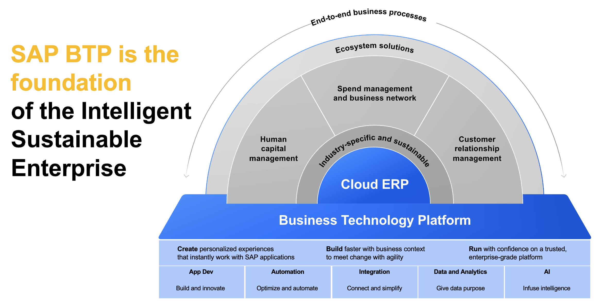

# SAP BTP reference architectures

## About this project

The SAP Business Technology Platform BTP forms the foundation of the Intelligent Sustainable Enterprise.

  

With its services and capabilities in the areas Application Development, Automation, Integration, Data and Analytics
as well as AI it offers powerful components that can be combined to fit SAP, partner and customer needs.

This repository contains various SAP BTP reference architecture diagrams. They are supposed to help architects when building solution architectures that combine different technology products & services. 

The diagrams cover a variety of areas and also support methodologies that SAP features:

- Hyperscaler related reference architectures
- reference architectures related to the [**SAP Integration Solution Advisory Methodology**](https://www.sap.com/services-support/integration-solution-advisory-methodology.html)
- reference architectures related to the [**SAP Application Extension Methodology**](https://help.sap.com/docs/architecture_guidance/2f804cb5e53d4279879009100a2b2082/cd963582f46d421c9abfd28dc25ea7e3.html?locale=en-US)
- reference architectures related to the [**SAP Data and Analytics Methodology**](https://blogs.sap.com/2023/03/15/release-of-sap-data-and-analytics-advisory-methodology/)
- *more areas will be provided soon*

The architectures are based on the official [**SAP SAP Business Technology Platform Solution Diagrams**](https://blogs.sap.com/2018/01/05/be-visual-use-official-icons-and-samples-for-sap-cloud-platform-solution-diagrams/)

You can download the latest version icons here:
- [BTP service icons here](https://d.dam.sap.com/a/s9tyyJJ?rc=10)
- [Terms of Use](https://d.dam.sap.com/a/nXJJmw/SAP%20Business%20Technology%20Platform%20Diagrams%20and%20Icons%20Terms%20of%20Use.pdf?rc=10)

Default templates for SAP open source repositories, including LICENSE, .reuse/dep5, Code of Conduct, etc... All repositories on github.com/SAP will be created based on this template.

## Support, Feedback, Contributing

This project is open to feature requests/suggestions, bug reports etc. via [GitHub issues](https://github.com/SAP/ap-btp-reference-architectures/issues). Contribution and feedback are encouraged and always welcome. For more information about how to contribute, the project structure, as well as additional contribution information, see our [Contribution Guidelines](CONTRIBUTING.md).

## Code of Conduct

We as members, contributors, and leaders pledge to make participation in our community a harassment-free experience for everyone. By participating in this project, you agree to abide by its [Code of Conduct](CODE_OF_CONDUCT.md) at all times.

## Licensing

Copyright 2023 SAP SE or an SAP affiliate company and ap-btp-reference-architectures contributors. Please see our [LICENSE](LICENSE) for copyright and license information. Detailed information including third-party components and their licensing/copyright information is available [via the REUSE tool](https://api.reuse.software/info/github.com/SAP/ap-btp-reference-architectures).
