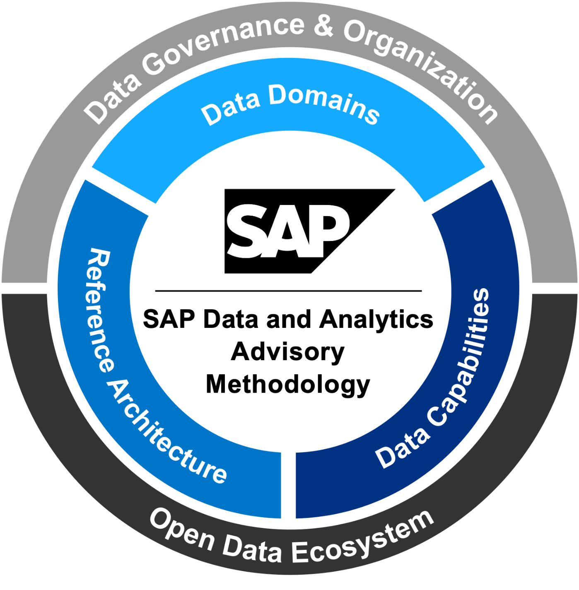

# Repository for the architecture artifacts of the SAP Data and Analytics Advisory Methodology

  

## Use Cases

- [Advanced Analytics](advanced-analytics/README.md)
- [Integrated Business Planning & Forecasting](integr-business-planning-and-forecasting/README.md)
- [Business Insight & Decision Support](business-insight-and-decision-support/README.md)
- [Data-driven Products & Services](data-driven-products-and-services/README.md)
- [Data Management](data-management/README.md)
- [Data Governance](data-governance/README.md)