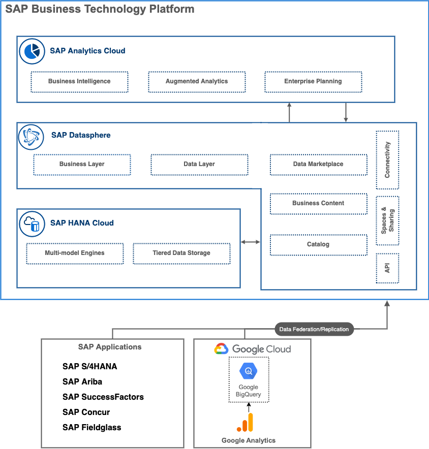

## **Analytical app**

Use Case Category: **Business Insight & Decision Support**

Use Case Pattern: **Analytical App**

### Description

Analytical Applications enable professional designers to use advanced scripting with a rich set of capabilities to create custom, complex applications. Usually the creation of Analytical Applications are aimed at IT or dedicated application specialists, since they require sufficient technical knowledge of the analytical applications toolsets e.g. SDKs, advanced visualization features, scripting & APIs. Analytical application UI components offer various properties to configure the look and feel, and behavior of the UI elements. Scripting is a core element of analytical applications as it extends configuration capabilities to define relationship between different UI elements on a page. Analytical applications can also be considered as extensions to dashboards​

### Data Architecture

### Architecture

---

:link: [BTP reference architecture (.drawio/diagrams.net) source file](architectures/analyticalapp.drawio)

### BTP services / SAP solutions

[SAP Analytics Cloud](https://discovery-center.cloud.sap/serviceCatalog/sap-analytics-cloud?region=all)

[SAP Cloud Identity Services](https://discovery-center.cloud.sap/protected/index.html#/serviceCatalog/identity-authentication?region=all)

[SAP Build Process Automation](https://discovery-center.cloud.sap/protected/index.html#/serviceCatalog/sap-build-process-automation?region=all)

[SAP Datasphere](https://www.sap.com/germany/products/technology-platform/datasphere.html)

### References

[Getting started with SAP Analytics Cloud | SAP Discovery Center](https://discovery-center.cloud.sap/missiondetail/3091/3112/)

[Plan and Predict Development of Workforce Demand and Supply](https://discovery-center.cloud.sap/missiondetail/3348/3391/)

----

## **Category Management**

Use Case Category: **Business Insight & Decision Support**

Use Case Pattern: **Operational Performance Managment**

Specific Use Case: **Category Management**

### Description

Analyze category performance for digital/online sales by combining external source systems like Google Analytics and sales, discounts, and stock data from SAP systems. 

**Improve customer experience** by uncovering potential revenue growth on certain items and understand the trends of secific product categories in a holistic and user friendly manner. Historical and real-time product sales & discounts are integrated right from your e-commerce solution alongside product characteristics and inventory data. Perform self-service automated analysis of category performance to improve customer experience for your online sales by understanding your most critical performance KPIs as well as your most important sales factors.

**Increase sales and profitability** by exploring KPIs like Online traffic for products across different regions or times of the day. Understand real-time consumer sentiment analysis based on real-time social media feeds.

**Improve tactical decision-making** by perform live category analysis. Create data models  for self-service analysis of category performance for digital. A holistic view of category performance of live on the fly analysis spanning multiple real-time data sources increases sales and profitability
by understanding the customer journey and enhancing tactical decision making for category performance managers.

With a data federation architecture, customers can leave data in its source system and access it in one location without replication. With this architecture customers can combine their Google BigQuery and SAP data to derive new insights.

### Architecture

---

:link: [BTP reference architecture (.drawio/diagrams.net) source file](architectures/CategoryManagement.drawio)

### BTP services / SAP solutions

[SAP Analytics Cloud](https://discovery-center.cloud.sap/serviceCatalog/sap-analytics-cloud?region=all)

[SAP Datasphere](https://www.sap.com/germany/products/technology-platform/datasphere.html)

[Google Cloud Platform BigQuery](https://cloud.google.com/bigquery)

[SAP Datasphere](https://www.sap.com/germany/products/technology-platform/datasphere.html)

### References

[Enable Category Management with BigQuery and SAP Datasphere | SAP Discovery Center](https://discovery-center.cloud.sap/missiondetail/3666/3709/)

[Integrate Google BigQuery and SAP Datasphere](https://discovery-center.cloud.sap/missiondetail/3409/3449/)
