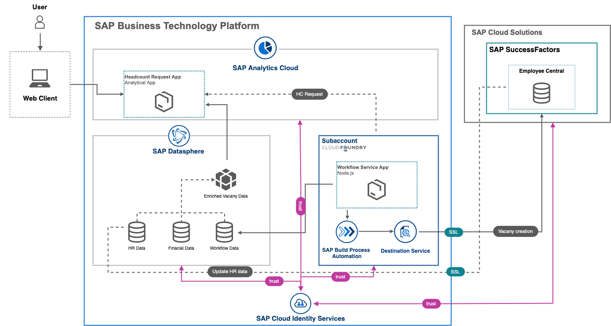

## Analytical app

Use Case Category: **Business Insight & Decision Support**

Use Case Pattern: **Analytical App**

### Description

Analytical Applications enable professional designers to use advanced scripting with a rich set of capabilities to create custom, complex applications. Usually the creation of Analytical Applications are aimed at IT or dedicated application specialists, since they require sufficient technical knowledge of the analytical applications toolsets e.g. SDKs, advanced visualization features, scripting & APIs. Analytical application UI components offer various properties to configure the look and feel, and behavior of the UI elements. Scripting is a core element of analytical applications as it extends configuration capabilities to define relationship between different UI elements on a page. Analytical applications can also be considered as extensions to dashboards​

### Data Architecture

### Architecture

---

:link: [BTP reference architecture (.drawio/diagrams.net) source file](architectures/analyticalapp.drawio)

### BTP services / SAP solutions

[SAP Analytics Cloud](https://discovery-center.cloud.sap/serviceCatalog/sap-analytics-cloud?region=all)

[SAP Cloud Identity Services](https://discovery-center.cloud.sap/protected/index.html#/serviceCatalog/identity-authentication?region=all)

[SAP Build Process Automation](https://discovery-center.cloud.sap/protected/index.html#/serviceCatalog/sap-build-process-automation?region=all)

[SAP Data Warehouse Cloud](https://www.sap.com/germany/products/technology-platform/data-warehouse-cloud.html)

### References

[Getting started with SAP Analytics Cloud | SAP Discovery Center](https://discovery-center.cloud.sap/missiondetail/3091/3112/)

[Plan and Predict Development of Workforce Demand and Supply](https://discovery-center.cloud.sap/missiondetail/3348/3391/)

