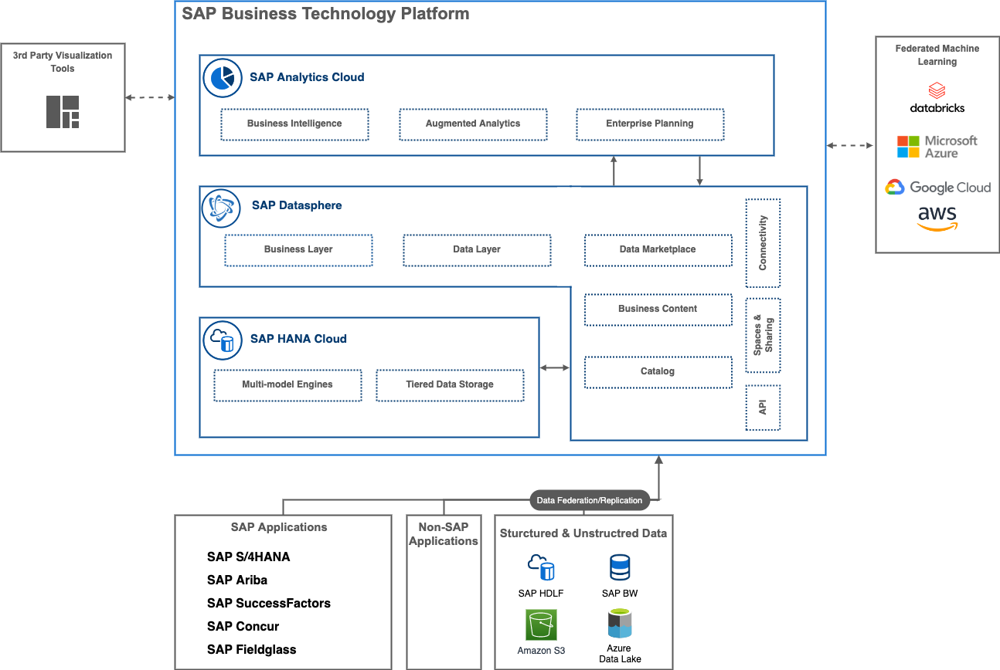

# Business Data Fabric

- [Business Data Fabric](/advanced-analytics/README.md#business-data-fabric)

## Business Data Fabric

Use Case Category: **Data Management**

Use Case Pattern: **Business Data Fabric**

### Description

Getting data from business applications is a significant challenge, the best approach isn’t to move data around and then try and reconstruct all the context that’s been lost. A Business Data Fabric solves this problem by keeping business data with its valuable context intact and up to date so its your authoritative source of information for analysis. SAP Datasphere is the technology foundation that enables a business data fabric. It simplifies complex data landscapes by unifying all data systems into a central layer with valuable business data.SAP Datasphere offers a variety of ways to collect or connect with data, regardless of where the data resides. It integrates with SAP applications and non-SAP systems to federate/replicate data across your most important data solutions—from lakehouses, data warehouses, data lakes, and data governance platforms.

### Architecture

---

:link: [Solution Architecture (.drawio/diagrams.net) source file](architectures/business-data-fabric.drawio)

### BTP services / SAP solutions

[SAP Datasphere](https://discovery-center.cloud.sap/#/serviceCatalog/a62771ea-b7bf-4746-9d4b-fec20ade5281)

### References

[A Deeper Look Into How SAP Datasphere Enables a Business Data Fabric](https://news.sap.com/2023/03/sap-datasphere-business-data-fabric/)

[Explore your Hyperscaler data with SAP Datasphere | SAP Discovery Center](https://discovery-center.cloud.sap/missiondetail/3656/3699/)

