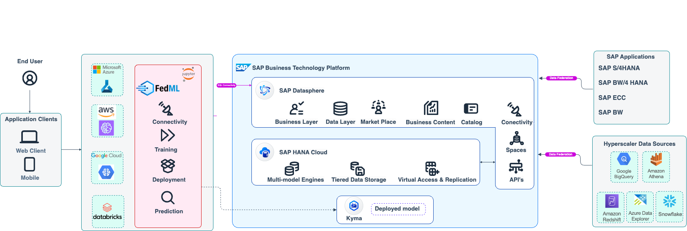

<!-- dc-ref-arch-metadata : 
    {
        "id": "ref-arch-fedml",
        "name": "Federated Machine Learning",
        "shortDescription": "The SAP Federated ML Python libraries (FedML) applies the Data Federation architecture of SAP Datasphere for intelligently sourcing SAP as well as non-SAP data for Machine Learning experiments done at the Hyperscalers thereby removing the need for replicating or moving data.",
        "archDiagramLink": "images/fedml.png",
        "tags": "Data Analytics, Cross, Cloud",
        "category": "Data Analytics",
        "labels": "Data Analytics, Cross, Cloud"
    }
dc-ref-arch-metadata  -->
### Architecture

<!-- dc-ref-arch-detail-page-start -->

## **Federated Machine Learning**

Use Case Category: **Predictive Analytics**

Use Case Pattern: **Federated Machine Learning**

### Description

The SAP Federated ML Python libraries (FedML) applies the Data Federation architecture of SAP Datasphere for intelligently sourcing SAP as well as non-SAP data for Machine Learning experiments done at the Hyperscalers thereby removing the need for replicating or moving data. By abstracting the Data Connection, Data load, and Model training (with flexibility and provision for user provided training scripts), Model Deployment, and Inferencing for Hyperscaler Machine learning processes , the FedML library provides end to end integration with few lines of code .

<!-- dc-ref-arch-detail-page-end -->

### BTP services / SAP solutions
<!-- dc-ref-arch-services-start -->
[SAP Datasphere](https://discovery-center.cloud.sap/#/serviceCatalog/sap-datasphere?region=all)
<!-- dc-ref-arch-services-end -->
### References
<!-- dc-ref-arch-resources-start -->
[SAP Samples | GitHub ](https://github.com/SAP-samples/data-warehouse-cloud-fedml)
<!-- dc-ref-arch-resources-end -->
<!-- dc-ref-arch-related-missions-start -->
[Explore your Hyperscaler data with SAP Datasphere | SAP Discovery Center](https://discovery-center.cloud.sap/missiondetail/3656/3699/)
<!-- dc-ref-arch-related-missions-end -->
