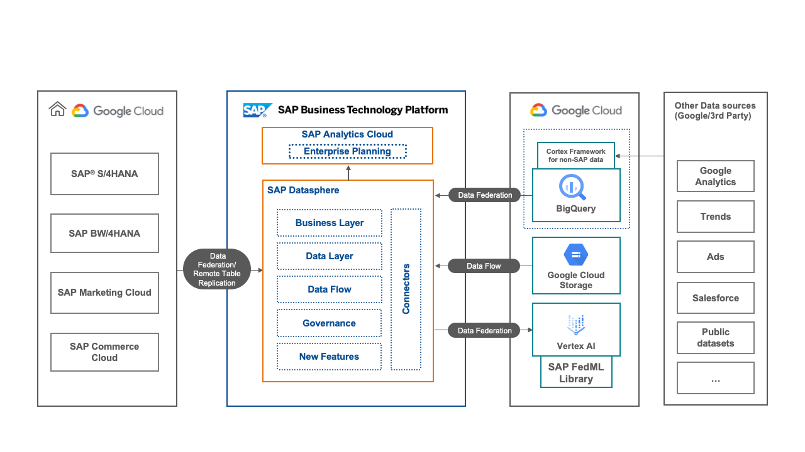

<!-- dc-ref-arch-metadata : 
    {
        "id": "ref-arch-google-datasphere",
        "name": "Google & SAP Datasphere Integration",
        "shortDescription": "Combine the data processing and analytical capabilities of the SAP Business Technology Platform based on SAP Datasphere and SAP Analytics Cloud with database, storage and AI capabilities of Google Cloud.",
        "archDiagramLink": "images/Google+Datasphere.png",
        "tags": "Hyperscaler, google, google cloud platform, gcp, sap datasphere, google bigquery, google cloud storage, vertex ai",
        "category": "Hyperscaler"
    }
dc-ref-arch-metadata  -->

<!-- dc-ref-arch-detail-page-start -->
## **Google & SAP Datasphere Integration**

The solution diagram above shows how you can combine the data processing and analytical capabilities of the SAP Business Technology Platform based on SAP Datasphere and SAP Analytics Cloud with database, storage and AI capabilities of Google Cloud such as BigQuery, Google Cloud Storage and Vertex AI.
SAP Datasphere enables a business data fabric architecture that uniquely harmonizes mission-critical data across the organization, unleashing business experts to make the most impactful decisions. It provides federated data access and remote table replication from SAP line of business solutions.
In this architecture Google Cloud services are used to augment the capabilities of SAP Datasphere:

**A.    Federate data from Google BigQuery**

Google BigQuery is used as an analytical data store for different kinds of external data, especially for Google Analytics, Trends and Ads data. It is also a good choice for importing public datasets or analytical datasets from 3rd party line of business applications like Salesforce using the Google Cortex framework.
By federating the data from Google BigQuery into SAP Datasphere the built-in analytical in-memory capabilities of SAP HANA in SAP Datasphere can be used to analyze the combined dataset from SAP originated data with 3rd party data, avoiding lengthy data transfer and costly ETL processing. In best case the data is federated from all sources and the resulting analytical dashboard is displayed realtime in SAP Analytics Cloud.

**B.    Importing data into SAP Datasphere from Google Cloud Storage with Data FLow**

The ETL (Extract Transform Load) capabilities of SAP DataSphere are called Data Flow. They can be used to import datasets from a cost-efficient object store like Google Cloud Storage. With this approach the data can be transformed during the transfer and persisted "physically" in SAP Datasphere.

**C.    Using "live"-data from SAP Datasphere with Google Vertex AI for inference and training with the SAP FedMl Library**

Traditionally, using a dataset with a hyperscaler machine-learning or AI service like Google Vertex AI requires persisting the data on the hyperscaler platform, e.g. in Google Cloud Storage or Google BigQuery. Using the open-sourced SAP FedML library data accessible in SAP Datasphere (virtually or physically) can be directly used in a Jupyter Notebook to train a ML model or for inference with Google Vertex AI. 
<!-- dc-ref-arch-detail-page-end -->

### BTP services / SAP solutions
<!-- dc-ref-arch-services-start -->
The reference architecture for Google & SAP Datasphere Integration uses the following SAP BTP services:

- [SAP Datasphere](https://discovery-center.cloud.sap/serviceCatalog/sap-datasphere?region=all): SAP Datasphere enables a business data fabric architecture that uniquely harmonizes mission-critical data across the organization, unleashing business experts to make the most impactful decisions. It combines previously discrete capabilities into a unified service for data integration, cataloging, semantic modeling, data warehousing, and virtualizing workloads across SAP and non-SAP data.

- [SAP Analytics Cloud](https://discovery-center.cloud.sap/serviceCatalog/sap-analytics-cloud?region=all): SAP Analytics Cloud is an open cloud solution built for software as a service (SaaS) that combines analytics and planning to instantly move from insight to action. Decision makers can simulate any scenario and automatically generate plans from smart predictions. SAP Analytics Cloud utilizes the full context of SAP data and brings analytics closer to the point of decision, while comprehensive prebuilt SAP business content is available to accelerate analytics and planning projects.
<!-- dc-ref-arch-services-end -->

### Resources
<!-- dc-ref-arch-resources-start -->
For more information about the different technologies used in the reference architecture above, more detailed explanations and example code, check out the following resources:
- Blog post: [SAP Datasphere – the next generation of SAP Data Warehouse Cloud](https://blogs.sap.com/2023/10/11/sap-datasphere-the-next-generation-of-sap-data-warehouse-cloud/)
- Blog post: [Powering Efficient Supply Chains: SAP Datasphere’s Integration with Google Cloud’s Architecture](https://blogs.sap.com/2023/06/29/powering-efficient-supply-chains-sap-dataspheres-integration-with-google-clouds-architecture/)
- Blog post: [Federated Machine Learning using SAP Datasphere & Google Cloud Vertex AI 2.0](https://blogs.sap.com/2022/06/14/federated-machine-learning-using-sap-data-warehouse-cloud-google-cloud-vertex-ai-2.0/)
- Documentation: [SAP Datasphere](https://help.sap.com/docs/SAP_DATASPHERE)
- Documentation: [SAP Analytics Cloud](https://help.sap.com/docs/SAP_ANALYTICS_CLOUD)
- GitHub: [SAP-samples/datasphere-fedml](https://github.com/SAP-samples/datasphere-fedml)
<!-- dc-ref-arch-resources-end -->

### Related SAP Discovery Center Missions
<!-- dc-ref-arch-related-missions-start -->
If you would like to implement solutions that are related to this reference architecture and the technologies used you may continue with the following SAP Discovery Center missions:
- [Integrate Google BigQuery and SAP Datasphere](https://discovery-center.cloud.sap/missiondetail/3409/3449/)
- [Enable Category Management with BigQuery and SAP Datasphere](https://discovery-center.cloud.sap/missiondetail/3666/3709/)
- [Predict your Supply Chain with Google Vertex AI and FedML](https://discovery-center.cloud.sap/missiondetail/4200/4453/)

<!-- dc-ref-arch-related-missions-end -->
