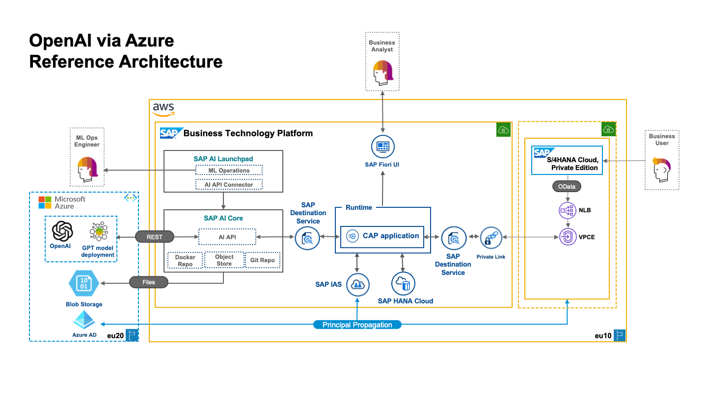

# Usage of LLMs on the example of GPT Models of OpenAI

You want to make use of one of the Large Language Models (LLMs) like the GPT family of LLMs offerd by OpenAI in combination with an application running on Business Technology Platform (BTP)), here is our recommendation how to achieve this and also benefit from the BTP capabilities.

## Potential Use Cases

Why would you want to do this? The list of potential use cases for LLMs is endless, here just a few examples:
* Generate proposals or recommendations of common topics, e.g. "what can I do to reduce my CO2 footprint in the context of a vegan diet"
* Generate email text for a fixed purpose and enrich it with  data from your application or the ERP system
* Classify free text input or incoming mails into predefined categories
* Combine the language processing power of an LLM with the search on domain specific data or documents
* ... see the [The ChatGPT Cheat Sheet](https://drive.google.com/file/d/1OcHn2NWWnLGBCBLYsHg7xdOMVsehiuBK/view) or any other source for more

## The Reference Architecture

The major cornerstones of the architecture skeched below are
* [GPT Model of Azure OpenAI Services](#gpt-model-of-openai)
* [SAP AI Core Service](#ai-core)
* [CAP Application](#cap-application)

### GPT Model on Azure OpenAI Services

In principal, we could use any LLM or similar powerful service available as an offering by one of the hyperscalers. In this case, we are referring to GPT-3 or similar newer instances originating from Open AI. These are deployed on the Azure infrastructure by Microsoft and accessible remotely.

### AI Core

AI Core is a service on BTP which is the central place for all things related to AI, offering infrastructure as well as GPU acceleration if needed.

* I a simple use case, AI Core can be used as an intermediary to the external models and AI services.
* It is also the place where support for LLM-related added services will be concentrated. This can include prompt engineering, preparation and control of data before usage in prompts or requests to external AI, and also postprocessing and validation of results.
* For more advanced use cases, when combining domain specific models with LLMs e.g. for search on only localy available domain specific documents, the model can be taken care by AI Core. Especially in those cases, the training and model management infrastructure and  GPU acceleration can come very handy, see also [SAP AI Core - Service Guide chapter 4](https://help.sap.com/doc/c31b38b32a5d4e07a4488cb0f8bb55d9/CLOUD/en-US/f17fa8568d0448c685f2a0301061a6ee.pdf)

In a first and simple approach here, we use AI Core to act as an proxy to access the external AI services and to expose a destination which can be consumed by your application.

### CAP Application

The CAP application is implementing your use case. SAP recommendation is to adopt the [Golden Path](https://d.dam.sap.com/s/i/a/HuUyuNr/Golden%20Path%20Guidance%20Paper.pdf) and build the application using Cloud Application Programming ([CAP](https://cap.cloud.sap/docs/)) as the entitiy layer of the application and [SAP UI5](https://ui5.sap.com/) if a user interface is required.

The application can of course also use a destination and the [SAP Destination Service](https://discovery-center.cloud.sap/serviceCatalog/destination?service_plan=lite&region=all&commercialModel=cloud) to connect to an LOB application like S/4HANA.

The most important part in our example is the connection to the external AI service via AI Core. AI Core provides a service whcih can be accessed through the respective destination.

## Example

To understand this architecture approach in detail, we recommend to review our example which demonstrates the described architecture in a minimal way. 
See [Kays example on SAP Samples](TODO)

## Further References

* [The ChatGPT Cheat Sheet](https://drive.google.com/file/d/1OcHn2NWWnLGBCBLYsHg7xdOMVsehiuBK/view)
* [Golden Path Guidance Document](https://d.dam.sap.com/s/i/a/HuUyuNr/Golden%20Path%20Guidance%20Paper.pdf)
* [North Star](https://go.sap.corp/northstar)
* [SAP CAP](https://cap.cloud.sap/docs/) - [Blog on CAP starting point](https://blogs.sap.com/2018/10/10/application-programming-model-start-here/)
* [SAP UI5](https://ui5.sap.com/) - [Blog on SAP UI5 starting point](https://blogs.sap.com/2021/08/23/what-is-sapui5/)
* [SAP Destination service](https://discovery-center.cloud.sap/serviceCatalog/destination?service_plan=lite&region=all&commercialModel=cloud)
* [Connectivity Service](https://discovery-center.cloud.sap/serviceCatalog/connectivity-service?service_plan=lite&region=all&commercialModel=cloud)
