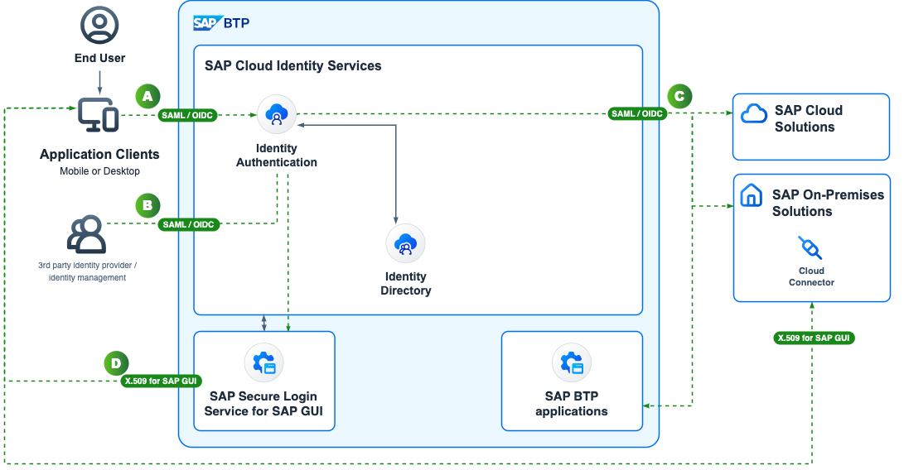

<!-- dc-ref-arch-metadata : 
    {
        "id": "ref-arch-cloud-leading-authentication",
        "name": "Cloud leading Authentication",
        "shortDescription": "This reference architecture describes the authentication flows for SAP applications via the SAP Cloud Identity Services - Identity Authentication.",
        "archDiagramLink": "images/SAP_IAM_SD_AuthN_2024.png",
        "tags": "Integration , sap integration , identity, identity access management, iam, IAM, BTP IAM, user management, user, access, authorization, Cloud Identity, SAP Cloud Identity, IAS, IPS, IDDS, IdDS, AMS, authorization management",
        "category": "Security"
    }
dc-ref-arch-metadata  -->
<picture>
 <source media="(prefers-color-scheme: dark)" srcset="./images/SAP_IAM_SD_AuthN_2024.png">
 <source media="(prefers-color-scheme: light)" srcset="./images/SAP_IAM_SD_AuthN_2024.png">
 
</picture>
<!-- dc-ref-arch-detail-page-start -->

## **Cloud leading Authentication**

The main (nonhuman) interacting actors in the model are identity providers, service providers, and the IAM services supported by SAP BTP. As shown in the figure Identity providers are systems that assert user information to service provider systems, vouching for the identity of the users who require access to their services. For this purpose, the identity provider issues a security token that can be accepted as an alternative that eliminates having to authenticate a user repeatedly. Service providers are systems that offer the business and technical services that users require to do their work. 

Finally, the SAP Cloud Identity Services can act as identity provider, capable of performing authentication or as a broker forwarding the requests to third-party providers. 
In the scenario in the figure the SAP Cloud Identity Services redirect the incoming authentication request to a configured Identity Provider and act as broker. This scenario is very common for employee scenarios if the company uses one central IdP across several vendors. This scenario also works in combination with new applications which use the Identity Directory within the SAP Cloud Identity Services to store the identities and their assignments. SAP Cloud Identity Services can verify against the Identity Directory if and how the authentication flow should be federated to an external Identity Provider or which attributes would be merged into the authentication tokens which are only relevant for the SAP landscape.
As conclusion the SAP Cloud Identity Services act either as the secure Identity Provider for your SAP landscape or as a facade for the SAP applications to your existing Identity Provider. In both setups you benefit from the templates and integrations within the SAP environment and a lower integration effort into your non-SAP cybersecurity toolset.

## Flow

The following flows start in the application. Those are known as SAML Service Provider initiated and OIDC Resource Provider initiated flow. Those are the most common scenarios.

> <ins>Note:</ins> If SAML is used in the complete chain then  (3rd party) IdP initiated SAML flows  are supported,  but this would be just an option and not the default or recommendation.

### A) SP / RP initiated flow (SAML / OIDC) for Web applications

The following flow can be applied to SAP Cloud applications and SAP On-Premises applications (incl. private cloud) which are integrated with the SAP Cloud Identity Services - Identity Authentication.

1. The authentication flow starts by an application / business user as shown in the upper left corner of the diagram. The **user** accesses the SAP application via an **Application Client (here a browser like Chrome)**.
2. The SAP Cloud or SAP On-Premises (incl. private cloud) application does not find an active session via a cookie in the browser.
3. The SAP application redirects the application client to the IAS.
4. The IAS asks the application client for a X.509 certificate or if no known certificate was presented it would try to get the user authenticated.
5. The IAS checks the application-configuration for the calling application if any Corp.IdP forwarding is in place.
    - no: The IAS presents a login screen
    - yes: e.g. in general for all SAP applications a redirect is enabled - IAS redirects the application client to the 3rd party Identity Provider

### B) Federation flow with 3rd party Identity Providers (IdP) for Web applications

6. The 3rd party Identity Provider authenticates the user.
7. The 3rd party IdP redirects the application client with the authenticated user details to IAS.
8. The IAS accepts the incoming token and processes it based on the app-configuration.
> :warning: In the past the common scenario was [**IAS proxy**](https://help.sap.com/docs/identity-authentication/identity-authentication/corporate-identity-providers?locale=en-US) without the user present in IdDS. This reference architecture expects the user present in IdDS and the [***Federation setting "Use Identity Authentication user store" enabled***](https://help.sap.com/docs/identity-authentication/identity-authentication/corp-idp-configure-identity-federation?locale=en-US#context) :warning:

### C) Application authentication for Web applications

9. The IAS creates a new token based on the application-configuration SAML or OIDC with attributes used from the 3rd party IdP and/or from the IdDS.
10. The IAS redirects the application client to the application.
11. The application accepts the token from IAS and creates a new user-session. The user is logged in.

### D) SAP GUI Single Sign-On

The Single Sign-On flow for SAP GUI applications re-uses the same authentication flow with Cloud Identity Services - Identity Authentication as the Web applications. The difference is that the SAP GUI uses a different protocol. The SAP GUI uses X.509 certificates for the authentication. The flow is as follows:

1. The users starts the SAP GUI and activates the SSO features with SAP Cloud Identity Services.
2. The user authenticates against the IAS.
3. The IAS creates a new OIDC token with attributes. As described above the attributes could come from the 3rd party IdP and/or from the IdDS. IAS hands the token over to the [SAP Secure Login Service for SAP GUI](https://help.sap.com/sls) (SLS). 
4. The SLS creates a short term X.509 certificate for the authenticated user and stores it in the certificate store the SAP GUI uses.
5. The SAP GUI uses the X.509 certificate to authenticate against the SAP application.

## Characteristics

This setup has the following characteristics:
- One Authentication interface for all SAP applications via the SAP Cloud Identity Services - Identity Authentication
- Preconfigured trusts between the SAP Cloud Identity Services and the SAP Cloud applications
- Resource Provider initiated and Service Provider initiated SAML and OIDC flows are supported. An Identity Provider initiated SAML flow is technically supported but not the default or recommendation.
- The Central user store - SAP Cloud Identity Services - Identity Directory - is used to store the user identities and their assignments which allows the merge of attributes during the authentication flow into the tokens e.g. groups can be mapped from the IdDS to the application token.
- Technically the IAS terminates the authentication flow and creates a new token for the application. 
<!-- dc-ref-arch-detail-page-end -->

### Services and Components
<!-- dc-ref-arch-services-start -->
- [SAP Cloud Identity Services - Identity Provisioning](https://discovery-center.cloud.sap/serviceCatalog/identity-provisioning?service_plan=sap-cloud-to-sap-cloud&region=all&commercialModel=cloud)
- [SAP Cloud Identity Services - Identity Authentication](https://discovery-center.cloud.sap/serviceCatalog/identity-authentication?region=all) <!-- dc-svc-metadata: {"isPrimary": "true"} dc-svc-metadata -->

<!-- dc-ref-arch-services-end -->

### Resources
<!-- dc-ref-arch-resources-start -->
- [SAP Cloud Identity Services - Identity Directory](https://api.sap.com/api/IdDS_SCIM/overview)
- [SAP Cloud Identity Services - Authorization Management](https://help.sap.com/docs/identity-authentication/identity-authentication/configuring-authorization-policies?version=Cloud)
- [SAP Cloud Identity Services](https://help.sap.com/docs/cloud-identity?version=Cloud&locale=en-US)
- [SAP Secure Login Service for SAP GUI](https://help.sap.com/sls)
<!-- dc-ref-arch-resources-end -->

### Related Missions
<!-- dc-ref-arch-related-missions-start -->
- [Get Started with SAP BTP - Cloud Identity](https://discovery-center.cloud.sap/missiondetail/4325/4605/)
- [Configure identity lifecycle management in a hybrid SAP landscape](https://discovery-center.cloud.sap/missiondetail/3116/3152/)
- [Establish single sign-on to your cloud solutions](https://discovery-center.cloud.sap/missiondetail/3114/3151/)
<!-- dc-ref-arch-related-missions-end -->
