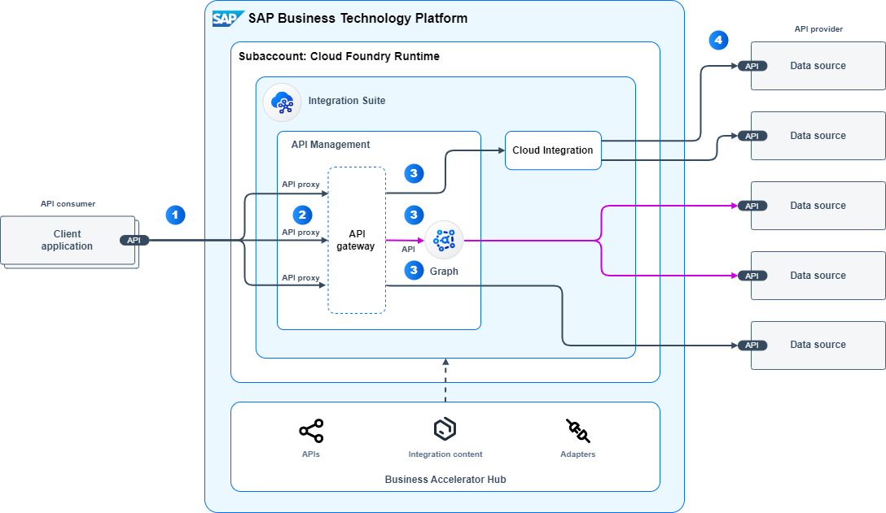

<!-- dc-ref-arch-metadata : 
    {
        "id": "ref-arch-api-managed-integration",
        "name": "API Managed Integration",
        "shortDescription": "API-managed integration allows you to provide omni-channel and secure access to business applications that can also hide the complexity of underlying heterogeneous landscapes.",
        "archDiagramLink": "images/ref-arch-api-managed-integration.png",
        "tags": "Integration, API, API management, Graph, business data graph, isa-m, sap integration suite, cross use case",
        "category": "Integration"
    }
dc-ref-arch-metadata  -->

<!-- dc-ref-arch-detail-page-start -->
## **API Managed Integration for Cloud Deployment**
Application Programming Interfaces (APIs) enable integration, interoperability and data sharing between software systems. With the help of an API management solution like the API Management capability within SAP Integration Suite you can provide omni-channel and secure access to solutions. Furthermore, it allows you to enforce usage policies for APIs, controlling API access, analyzing API consumption and more. 
This reference architecture is based on the concepts of the **SAP Integration Solution Advisory Methodology**: Thereof, API managed integration is defined as cross use case pattern. These can complement other integration use case patterns. 

### Flow
The reference architecture diagram shows the runtime perspective for API managed integration. Let’s take a look at the steps in detail:
1.	The data flow starts with an application which acts as an API consumer in this integration scenario. This application could be an SAP or third-party solution, a custom-built app or any other type of application which can consume APIs. It sends out an API call using a REST based, OData or SOAP based API.
2.	These API calls are intercepted by the API Management capability within SAP Integration Suite before they are sent to the respective API provider. API Management adds a harmonious protection layer for all API calls which pass its gateway. For this purpose, APIs are exposed as API proxies on API Management which realize a discrete representation of an API entity (an API façade): It abstracts the actual proxy end point properties at one end and the actual target. An API proxy includes configuration files, policies, and code snippets to enforce security measures (such as authentication and authorization), transformations (such as modifications of API requests and responses), governance (such as applying throttling, caching) and insights (like monitoring and analytics of API consumption).
3.	For creating such API proxies, API administrators can reuse policies templates to secure APIs. These are published at SAP Business Accelerator Hub along other artifacts, such as available APIs for SAP business applications, prepackaged integration content for Cloud Integration and more.
4.	The further flow toward the API provider depends on the actual use case. Let’s have a look at the different options:
    - API managed cloud integration: If your integration scenario has got advanced mediation and transformation requirements that are not supported by API Management you additionally use Cloud Integration for such tasks. 
    - API managed data graph: Graph is a capability of API Management. It allows you to expose all your business data from SAP business solutions and beyond in the form of a semantically connected data graph. In turn, with the help of Graph you can access data from several data sources via a single unified API. With this use case you can take advantage of a simplified consumption of business data across different data sources realized by a business data graph.
    - A managed API: In this use case the API requests are forwarded to the different API providers. It is suited for integration scenarios which require no or simple transformations and protocol adaptations that can be accomplished by API Management.
5.	Finally, the API calls are sent to the respective data sources which act as API providers within the integration scenario. A data source can be any type of application such as an SAP, third-party or custom-built solution.

### Characteristics 
An architecture for API managed integration can be characterized as follows:
- **Governed API consumption**: This allows you to govern the full lifecycle of APIs. It includes the consumption of APIs by enforcing policies, ensuring compliance and control over the integration process.
- **Decoupled integratio**n: With the help of an API façade you can abstract the API from its actual implementation. By doing so, it can enable a decoupled integration between systems, meaning that each system can evolve independently without affecting the others.
- **Advanced protection**: Ensure API security via policies, traffic protection, and compliance.
- Provides visibility and analytical insights: You can centrally collect and analyze API metrics, including option to monetize API consumption.
- **Enables integration and interoperability between software systems**: You can perform transformation and mediations, including a simplified consumption of APIs when using data graphs, to enable interoperability between API providers and consumers.

### Examples in an SAP Context
SAP doesn’t deliver predefined integration scenarios that follow an API managed integration approach. API management solutions are typically implemented by customers or partners. Please find below typical reasons using API managed:
- Achieve a consistent and harmonized omni-channel experience.
- Manage and protect business-critical API assets.
- Simplify integration with SAP and other API providers.	
- Realize revenue in the cloud-native economy.
<!-- dc-ref-arch-detail-page-end -->

### Services and Components
<!-- dc-ref-arch-services-start -->
- [SAP Integration Suite](https://discovery-center.cloud.sap/serviceCatalog/integration-suite?region=all)
<!-- dc-ref-arch-services-end -->

### Resources
<!-- dc-ref-arch-resources-start -->
- [SAP Business Accelerator Hub](https://hub.sap.com)
- [SAP API Management – Overview & Getting started (blog post)](https://blogs.sap.com/2016/03/03/sap-api-management-overview-getting-started/)
- [API Management capability within SAP Integration Suite (documentation)](https://help.sap.com/docs/sap-api-management)
- [Cloud Integration capability within SAP Integration Suite (documentation)](https://help.sap.com/docs/cloud-integration)
- [SAP Integration Solution Advisory Methodology (documentation)](https://help.sap.com/docs/architecture_guidance/f64ada51d9f44c83a751b96f955aad5a/85bcc8675d3e42718279bf7b87dafc2d.html?locale=en-US)
- [Modernize Integration with SAP Integration Suite (openSAP course)](https://open.sap.com/courses/btp3)
- [SAP Integration Suite (SAP Community)](https://community.sap.com/topics/integration-suite)
<!-- dc-ref-arch-resources-end -->

### Related Missions
<!-- dc-ref-arch-related-missions-start -->
- [Get Started with Integration Suite - API Management](https://discovery-center.cloud.sap/missiondetail/3062/3072/)
- [Create simple, connected digital experiences with API-based integration](https://discovery-center.cloud.sap/missiondetail/3062/3072/)
<!-- dc-ref-arch-related-missions-end -->
