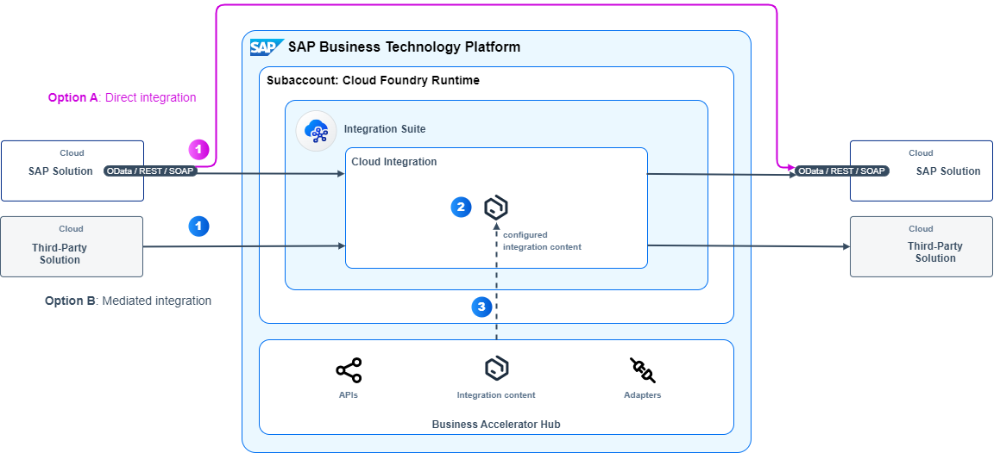

<!-- dc-ref-arch-metadata : 
    {
        "id": "ref-arch-application-integration",
        "name": "Application to Application Integration",
        "shortDescription": "With the help of application-to-application (A2A) integration you can exchange transactional data along internal company processes by connecting involved business applications in a (near-) real-time fashion.",
        "archDiagramLink": "images/ref-arch-a2a-integration.png",
        "tags": "Integration",
        "category": "Integration"
    }
dc-ref-arch-metadata  -->

<!-- dc-ref-arch-detail-page-start -->
## **Application to Application Integration**
With the help of application to application (A2A) integration you can exchange transactional data along internal company processes by connecting involved business applications in a (near-) real-time fashion. In most cases asynchronous messages are used for exchanging for exchanging transactional data where messages trigger the execution of the next process step in a connected business solution. Transactional data refers to data about ongoing business activities such as physical goods movement or sales order documents.
This reference architecture is based on the concepts of the **SAP Integration Solution Advisory Methodology**: Thereof, A2A integration is defined as an integration use case pattern which belongs to the process integration style. The diagram shows the scope of technology services and components for a cloud-based application landscape which refers to the integration domain Cloud2Cloud of the methodology. 
The reference architecture diagram shows the runtime perspective for A2A integration in a cloud deployment.

It comprises of two technical options:
- Option A is a direct integration approach that is based on aligned APIs. This option is available for selected SAP to SAP integration scenarios and is suited for simple landscapes only.
- Option B is a mediated integration approach that is using SAP Integration Suite. This option is applicable for A2A integration scenarios that are not based on aligned APIs. This holds true for a lot of SAP-to-SAP, SAP to third-party, and third-party to third-party integration scenarios. You can also use Cloud Integration for integration scenarios that are based on aligned APIs. Reasons for using route-through integration flows over the direct integration option are, for instance, the need to comply with company standards, to establish central monitoring capabilities, or to enable extensions such as routing to multiple receiving solutions.

Let’s take a look at the following data flow for each option in detail:

**A.	Direct integration**: 
1.	An SAP cloud solution issues transactional data through an OData, SOAP or REST based API over the public internet. The transactional data is sent out as a message which is a package of data comprising out of a header and a payload. The message header contains information such as the logical or physical receiver of the message and the payload contains the actual business data. The outbound API of the sending SAP cloud solution and the inbound API of the receiving SAP cloud solution are aligned with regards to the API definition (such as schema, transport protocol). From a technical point of view no kind of middleware is required for enabling interoperability. Thus, both solutions can directly exchange messages.
   
    This option is supported by selected SAP to SAP integration scenarios. You can also use the direct integration option for custom-build or partner solutions if these are also based on aligned APIs. 

**B.	Mediated integration using SAP Integration Suite**:
1.	An SAP or third-party solution issues transactional data: Either the solution actively sends out the transactional data or Cloud Integration pulls the data using a scheduler.
2.	Cloud Integration applies the required mediations (such as receiver determinations, filtering, aggregations) and transformations (such as structure and value mappings) to enable an interoperability between the sending and receiving solution(s). You can also Cloud Integration for integration scenarios that are based on aligned APIs by generating route-through integration flows. When using Cloud Integration, you can benefit from a decoupled integration of solutions. It also supports integration qualities like reliable message transport, guaranteed message delivery, error handling and more.
3.	For many SAP and third-party integration scenarios predefined integration content is available which you can find at SAP Business Accelerator Hub. You can easily implement such integration scenarios by copying integration content packages from the hub which you configure and deploy on your local Cloud Integration tenant. If there is no predefined integration content available, you can discover APIs for SAP solutions at the hub and design your own integration flows on Cloud Integration. At SAP Business Accelerator Hub you can also find a variety of adapters which you can import, configure and deploy on your Cloud Integration tenant to enable interoperability with the receiving solution(s).

<ins>Note</ins>: If you have a hybrid application landscape in place, that comprises of a mix of cloud and on-premise applications, you can adapt this reference architecture as follows by adding the following technologies:
- SAP Connectivity service which lets you establish connectivity between your cloud applications and on-premise systems running in isolated networks.
- SAP Application Interface Framework when using SAP ECC or SAP S/4HANA. It allows you to develop and monitor interfaces as well as execute error handling in a single framework residing in your SAP backend system.
  
This variant applies then to the integration domain Cloud2OnPremise of SAP Integration Solution Advisory Methodology.

### Characteristics
The following list outlines characteristics, which are specific for an A2A integration architecture:
- **Use of asynchronous communication**: This is the preferred communication method for most A2A integration scenarios which eliminates a tight coupling between business applications and increases resilience. For this purpose, you use SOAP, REST or OData which support asynchronous communication. You use synchronous communication only if your business scenario requires a synchronous processing (example: Availability to promise check of stock for planned orders).
- **Based on directed messages**: Such a message type is used to exchange transactional data between sending and receiving solutions. Directed means that the sender addresses one or more receivers which are determined either within the sending system (logical receiver) or within the integration technology (physical receiver).
- **Support of exception handling**: There are many reasons why exceptions occur, for instance unavailability of a receiving solution, incorrect message content, improper configuration settings. As a result, the transmission of messages will fail which require a proper exception handling.
- **Ensure transport- and message-level security**: For enabling transport-level security it is recommended to use secured communication as the data is exchanged over the public internet. For message-level security you use digital encryption and signatures in order to protect the content of messages that are exchanged between solutions. When using a mediated integration approach exception handling needs to be configured within the integration solution. In case of the direct integration approach exception handling needs to be supported by the involved solutions, for instance through implemented retry mechanisms within the sending solution in case the receiver cannot be reached.

### Examples in an SAP Context
SAP delivers predefined A2A integration scenarios along end-to-end business processes spanning across multiple SAP business applications. Here are some examples:
- Exchange of sales orders between SAP Commerce Cloud and SAP S/4HANA as part of the [Lead-to-Cash process (for cloud deployment)](https://api.sap.com/dfd/LC1C1-DFDTransactionalDataFlows)
- Transfer of purchase requisitions for materials that has no source of supply between SAP Ariba Sourcing and SAP S/4HANA as part of the [Source-to-Pay process (for cloud deployment)](https://api.sap.com/dfd/SP1C1-DFDTransactionalDataFlows)
- Replicate service entry sheets or timesheets from SAP Fieldglass Vendor Management System to SAP S/4HANA as part of the [External Workforce process (for cloud deployment)](https://api.sap.com/dfd/EW1H1-DFDTransactionalDataFlows)

### Reasonable Alternatives
For selected SAP lines-of-business solutions further integration technologies are available which are tailored to the needs of the respective business solution:

- [SAP Integration Suite, managed gateway for spend management and SAP Business Network](https://help.sap.com/docs/sisgw?locale=en-US): This solution, which is formerly known as SAP Ariba Cloud Integration Gateway, is based on SAP Integration Suite. It facilitates the integration of buyers' and suppliers' SAP ERP or SAP S/4HANA systems with intelligent spend solutions from SAP and SAP Business Network. Managed gateway includes self-service wizards for configuring predefined integration scenarios, automated testing, and real-time monitoring. It supports predefined integration scenarios related to spend management and Business Network solutions from SAP and also allows you to extend such scenarios to accommodate specific requirements. For more information about integration scenarios that are supported by the managed gateway see [overview guide for buyers](https://help.sap.com/docs/ARIBA_CIG/1b1724b5f3e248568430b640c0412c24/dabf918d862847728f00d80025e38f28.html?locale=en-US) and [overview guide for suppliers](https://help.sap.com/docs/ARIBA_CIG/791693e960f6494b8ea0a0bae07d406c/f13af7d9e5ea4bee9afb40249063833d.html?locale=en-US).

    You use managed gateway for predefined integration scenarios related to spend management and Business Network solutions from SAP. It also allows you to extend such predefined integration scenarios to accommodate specific requirements. You use the Cloud Integration capability within SAP Integration Suite for any custom integration scenarios that are not supported by the managed gateway.
<!-- dc-ref-arch-detail-page-end -->

### Services and Components
<!-- dc-ref-arch-services-start -->
- [SAP Integration Suite](https://discovery-center.cloud.sap/serviceCatalog/integration-suite?region=all)
- [SAP Connectivity service](https://discovery-center.cloud.sap/serviceCatalog/connectivity-service?region=all)
<!-- dc-ref-arch-services-end -->

### Resources
<!-- dc-ref-arch-resources-start -->
- [SAP Business Accelerator Hub](https://hub.sap.com)
- [SAP Application Interface Framework](https://help.sap.com/docs/SAP_APPLICATION_INTERFACE_FRAMEWORK_OVERVIEW)
- [Cloud Integration capability within SAP Integration Suite (documentation)](https://help.sap.com/docs/cloud-integration)
- [SAP Integration Solution Advisory Methodology (documentation)](https://help.sap.com/docs/architecture_guidance/f64ada51d9f44c83a751b96f955aad5a/85bcc8675d3e42718279bf7b87dafc2d.html?locale=en-US)
- [Modernize Integration with SAP Integration Suite (openSAP course)](https://open.sap.com/courses/btp3)
- [SAP Integration Suite (SAP Community)](https://community.sap.com/topics/integration-suite)
<!-- dc-ref-arch-resources-end -->

### Related Missions
<!-- dc-ref-arch-related-missions-start -->
- [Get started with SAP Integration Suite](https://discovery-center.cloud.sap/missiondetail/3258/3327/)
- [Publish Documents from SAP S/4HANA Cloud to SharePoint](https://discovery-center.cloud.sap/missiondetail/3324/3365/)
- [S/4HANA Cloud - Advance Shipping Notification](https://discovery-center.cloud.sap/missiondetail/3324/3365/)

<!-- dc-ref-arch-related-missions-end -->
