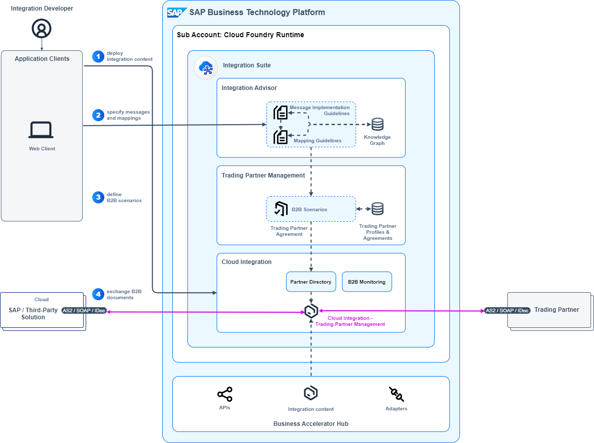

<!-- dc-ref-arch-metadata : 
    {
        "id": "ref-arch-b2b-integration",
        "name": "Business to Business Integration",
        "shortDescription": "With the help of the business-to-business (B2B) integration you can electronically exchange business documents with other organizations.",
        "archDiagramLink": "images/ref-arch-b2b-integration.png",
        "tags": "Integration, b2b, edi, trading partner, edifact, isa-m, process integration style, cloud2cloud, sap integration suite, trading partner management, integration advisor",
        "category": "Integration"
    }
dc-ref-arch-metadata  -->

<!-- dc-ref-arch-detail-page-start -->
## **Business to Business Integration**
With the help of the business-to-business (B2B) integration you can electronically exchange business documents with other organizations. It allows you to extend your business processes beyond your organization’s boundaries to include your business partners such as customers and suppliers. For enabling an electronic data exchange with those business partners, you need to align with them on common B2B standards, which includes document types, transport protocols, partner identification, security features and more.

This reference architecture is based on the concepts of the **SAP Integration Solution Advisory Methodology**: Thereof, B2B integration is defined as an integration use case pattern which belongs to the process integration style. The diagram shows the scope of technology services and components for a cloud-based application landscape which refers to the integration domain Cloud2Cloud of the methodology. 

### Flow
The flow and diagram include both the design- and runtime perspective which allows you to better understand the scope, purpose and interplay of the technical components and solutions for B2B integration. The first three steps belong to the design-time perspective and are typically performed by an integration developer. The remainder describes the runtime perspective about how B2B documents are exchanged with one or more trading partners.

Let’s take a look at each step in detail:

1.	**Copy prepackaged integration content**: An integration developer copies predefined integration content packages which SAP provides for Trading Partner Management capability within SAP Integration Suite from SAP Business Accelerator Hub and deploys it on the Cloud Integration tenant. The integration content provides a generic integration flow that dynamically consumes the configurations stored in the Partner Directory. This allows you to process B2B scenarios of many trading partners at lowest maintenance effort by using a single integration flow.
2.	**Specify messages and mappings**: For being able to exchange a B2B document with a specific trading partner, an integration developer needs to choose the corresponding message type from a library of type systems (such as EDIFACT, ANSI X.12, SAP IDoc) and tailor it to the specific requirements of the trading partner. For this purpose, the integration developer creates a message implementation guideline (MIG) and mapping guideline (MAG) using the knowledge graph of the Integration Advisor capability within SAP Integration Suite. This is an intelligent and crowd-sourced proposal service which proposes MIGs and MAGs with the best fit for a given trading partner: This is achieved by analyzing how such messages and mappings were designed for other trading partners having the same business context, such as industry classification, related business process, geo-political location and more. As a result, you can speed up the content creation to deployment process by almost 60% using Integration Advisor.
3.	**Define B2B scenarios**: An integration developer uses Trading Partner Management to define how B2B documents are exchanged with a specific trading partner. The integration developer creates a trading partner profile that provides reusable information about a company, organization or subsidiary. This includes information about business identifiers (such as DUNS number) used for setting up the communication with the trading partner to identify the trading partner and the type of B2B standard used. Next, the integration developer also creates a trading partner agreement using predefined trading partner agreement templates. This results in a contract defined by two trading parties that have decided to exchange certain business data using a B2B scenario. An agreement also links to the individually defined MIGs and MAGs which have been maintained in Integration Advisor before. Once a trading partner agreement is created and activated this information is pushed to the Partner Directory of Cloud Integration.
4.	**Exchange B2B documents**: At runtime a business solution (SAP or third-party solution) sends outs B2B documents using HTTPS based protocols such as AS2, SOAP towards Cloud Integration. Within Cloud Integration the B2B data is processed using the generic integration flow for Trading Partner Management and is sent to the receiving trading partner. This integration flows also uses the information maintained in the Trading Partner Agreement for other purposes if required such as validation of incoming and outgoing messages, message encryption/decryption, generation of functional acknowledgements and more. The exchange of B2B documents also works in the opposite direction: You can also receive B2B documents from trading partners accordingly.
Cloud Integration also includes a B2B monitoring solution which allows you to check the processing status of your B2B interchanges which is the incoming payload for B2B transactions.

<ins>Note</ins>: If you have a hybrid application landscape in place, that comprises of a mix of cloud and on-premise applications, you can adapt this reference architecture as follows by adding the following technologies:
- SAP Connectivity service which lets you establish connectivity between your cloud applications and on-premise systems running in isolated networks.
- SAP Application Interface Framework when using SAP ECC or SAP S/4HANA. It allows you to develop and monitor interfaces as well as execute error handling in a single framework residing in your SAP backend system.
This variant applies then to the integration domain Cloud2OnPremise of SAP Integration Solution Advisory Methodology.

### Characteristics
An architecture for B2B integration can be characterized as follows:
- **Inter-organizational data exchange**: B2B integration involves the exchange of business documents between two or more organizations aiming at a high level of automation.
- **Management of trading partner related information**: B2B integration requires the management of B2B relationships with many trading partners. These include for instance reusable information which is relevant for setting up a B2B scenario for the electronic exchange of business data with a trading partner like trading partner identification, supported B2B standards, acknowledgement handling, service level agreements and more.
- **Support of B2B standards**: B2B integration relies on the use of agreed standardized formats (such as EDIFACT, ANSI X.12, SAP IDoc) that also include trading partner identifiers and protocols (such as AS2, HTTPS) to ensure compatibility and interoperability between systems.
- **Secured communication**: As B2B documents are exchanged over the public internet you need to establish secure communication channels (transport-level security) and configuring digital encryption and digital signing of messages (message-level security).
- **Scaling design and runtime environment**: B2B integration requires scalable a solution that can accommodate the growth of trading partner networks and increasing data load. In most cases, the options for controlling the load of B2B documents from various trading partners are typically limited. This may include optimized features for trading partner onboarding and management, processing of bulk data.

### Examples in an SAP Context
Many SAP solutions, such as SAP S/4HANA Cloud, offer public APIs for B2B integration scenarios. In the following some examples in an SAP solution context are listed where you can apply the reference architecture for B2B integration for cloud deployment to:
- [Sales Order/Customer Return - Create, Update, Cancel (B2B)](https://help.sap.com/docs/SAP_S4HANA_CLOUD/03c04db2a7434731b7fe21dca77440da/4261582b6ca44d008c72be11b9a400e2.html?q=%22EDI%22%20Sales&locale=en-US) in SAP S/4HANA Cloud
- [Supplier Invoice - Create (B2B, Inbound, Asynchronous)](https://help.sap.com/docs/SAP_S4HANA_CLOUD/03c04db2a7434731b7fe21dca77440da/4261582b6ca44d008c72be11b9a400e2.html?q=%22EDI%22%20Sales&locale=en-US) in SAP S/4HANA Cloud 
- [Manage Just-In-Time Calls](https://help.sap.com/docs/SAP_S4HANA_CLOUD/d35113ee62644d3abee1aaec148291d9/2963c5246b334cca8787cc1aa4cd587c.html?q=%22EDI%22%20Just&locale=en-US) in SAP S/4HANA Cloud 

### Reasonable Alternatives
In the following alternative architectures and solution options for B2B integration for cloud deployment are briefly described:
- **API Managed Integration**: In selected cases it may also be possible to use public webservices based APIs for exchanging business data with trading partners. However, this requires that a standardized API based integration approach has been defined and agreed upon within an industry. Such standardization includes an agreement on the type of APIs used (such as SOAP, REST), document formats (such as predefined XML schemas), security requirements and more.
Example: Exchange of transport related information in the automotive industry:
This standard has been defined by the German Association of the Automotive Industry (VDA) and describes how to define and implement standardized REST-API interfaces for collaboration within the automotive industry and between the automotive industry and their partners which includes technical and a data model (for details, see [VDA4998 REST-API for transport track and trace](https://www.vda.de/en/news/publications/publication/vda-4998---rest-api-for-transport-track---trace---v1.0--2021-06).

    You use the Cloud Integration and the API Management capability of SAP Integration Suite for implementing B2B integration scenarios that are based on public APIs.

- **SAP Business Network and SAP Ariba solutions**: Instead of interacting with individual trading partners you can also join the SAP Business Network or SAP Ariba solutions for sourcing, procurement and supplier management. These enable organizations to collaborate with each other, either in the role of a customer or in the role of a supplier.

    You use [SAP Integration Suite, managed gateway for spend management and SAP Business Network](https://help.sap.com/docs/sisgw?locale=en-US), which is formerly known as SAP Ariba Cloud Integration Gateway, to integrate SAP ERP and SAP S/4HANA backend system with your trading partners and SAP Ariba solutions. Suppliers can also choose alternative options for integrating with SAP Business Network such as online option, EDI, and an API based approach (for details, see [How Suppliers connect to SAP Business Network](https://help.sap.com/docs/business-network-for-trading-partners/introduction-to-business-network/how-suppliers-connect-to-sap-business-network?locale=en-US)).
<!-- dc-ref-arch-detail-page-end -->

### Services and Components
<!-- dc-ref-arch-services-start -->
- [SAP Integration Suite](https://discovery-center.cloud.sap/serviceCatalog/integration-suite?region=all)
- [SAP Connectivity service](https://discovery-center.cloud.sap/serviceCatalog/connectivity-service?region=all)
<!-- dc-ref-arch-services-end -->

### Resources
<!-- dc-ref-arch-resources-start -->
- [SAP Business Accelerator Hub](https://hub.sap.com)
- [SAP Application Interface Framework](https://help.sap.com/docs/SAP_APPLICATION_INTERFACE_FRAMEWORK_OVERVIEW)
- [Cloud Integration capability within SAP Integration Suite (documentation)](https://help.sap.com/docs/cloud-integration)
- [SAP Integration Solution Advisory Methodology (documentation)](https://help.sap.com/docs/architecture_guidance/f64ada51d9f44c83a751b96f955aad5a/85bcc8675d3e42718279bf7b87dafc2d.html?locale=en-US)
- [Modernize Integration with SAP Integration Suite (openSAP course)](https://open.sap.com/courses/btp3)
- [SAP Integration Suite (SAP Community)](https://community.sap.com/topics/integration-suite)
-  [Integration Advisor: Overview of components for building B2B integration content and further reading (blog post)](https://blogs.sap.com/2021/09/28/integration-advisor-overview-of-components-for-building-b2b-integration-content-and-further-reading/)
- [Announcement: SAP Trading Partner Management and B2B Monitoring brand new capabilities of SAP Integration Suite is released! (blog post)](https://blogs.sap.com/2021/12/17/announcement-sap-trading-partner-management-and-b2b-monitoring-brand-new-capabilities-of-sap-integration-suite-is-released/)
- [Integration Advisor capability within SAP Integration Suite (documentation)](https://help.sap.com/docs/cloud-integration/sap-cloud-integration/sap-integration-advisor?q=SAP%20Integration%20Advisor&locale=en-US)
- [Trading Partner Management capability within SAP Integration Suite (documentation)](https://help.sap.com/docs/cloud-integration/sap-trading-partner-management/sap-trading-partner-management?q=SAP%20Trading%20Partner%20Management&locale=en-US)
- [Integration Advisor Capability of SAP Integration Suite (openSAP course)](https://open.sap.com/courses/s4h20)
  
<!-- dc-ref-arch-resources-end -->

### Related Missions
<!-- dc-ref-arch-related-missions-start -->
- [Get started with SAP Integration Suite](https://discovery-center.cloud.sap/missiondetail/3258/3327/)
<!-- dc-ref-arch-related-missions-end -->
