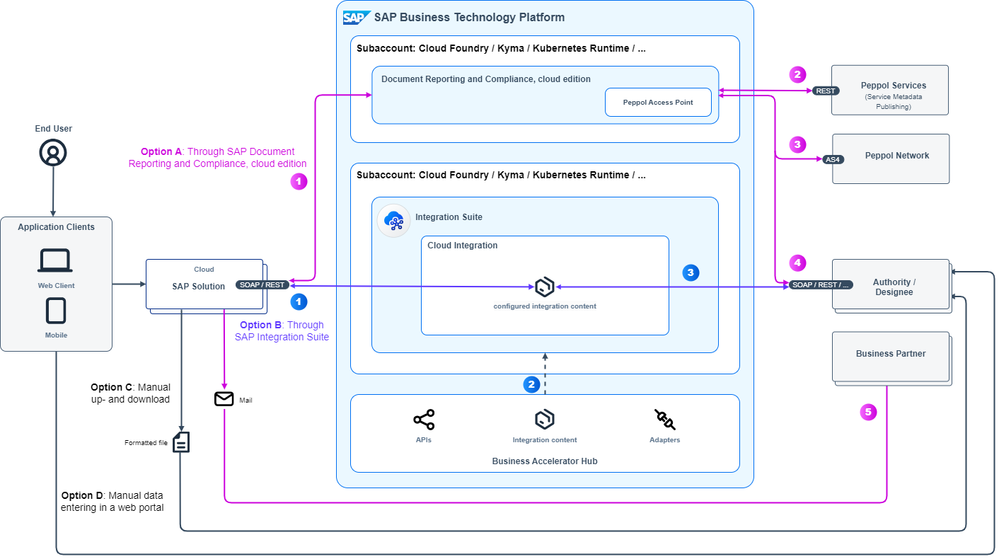

<!-- dc-ref-arch-metadata : 
    {
        "id": "ref-arch-b2g-integration",
        "name": "Business to Government Integration",
        "shortDescription": "In many countries or regions organizations need to comply with local requirements mandating the submission of electronic documents such as invoices, summaries, or transport registrations, and statutory reports to external communication parties.",
        "archDiagramLink": "images/ref-arch-b2g-integration.png",
        "tags": "Integration, business-to-government integration, b2g, drc, isa-m, process integration style, cloud integration, sap integration, edocuments, compliance, sap document reporting and compliance",
        "category": "Integration"
    }
dc-ref-arch-metadata  -->

<!-- dc-ref-arch-detail-page-start -->
## **Business to Government Integration**
In many countries or regions organizations need to comply with local requirements mandating the submission of electronic documents such as invoices, summaries, or transport registrations, and statutory reports to external communication parties. Depending on the given exchange model these documents are transmitted through an authority, a regulated service provider, a regulated network or directly to the business partner. The actual exchange of data may be completely electronic or may require data to be downloaded or uploaded.

This reference architecture is based on the concepts of the **SAP Integration Solution Advisory Methodology**: Thereof, business to government integration is defined as an integration use case pattern which belongs to the process integration style. The diagram shows the scope of technology services and components for a cloud-based application landscape which refers to the integration domain Cloud2Cloud of the methodology. 

### Flow
There are four options about how SAP cloud solutions, such as SAP S/4HANA Cloud, SAP Concur, SAP Business Network, SAP BusinessByDesign, exchange electronic documents and statutory reports with external communication parties: These options range from a fully electronically exchange (option A and B in the diagram), manual down- and upload of formatted files (option C in the diagram) to the manual entering of data in a web portal (option D in the diagram). Which option is chosen depends on the technical integration requirements supported by the local authority. Whenever possible, a direct electronic transmission is supported. You can find an overview about which option per country/region and task are supported at SAP Help Portal (for SAP S/4HANA Cloud, see [Supported Compliance Tasks by Country/Region](https://help.sap.com/docs/SAP_S4HANA_CLOUD/71af4585db6d4904b1724730f3776c9b/097165e9c1074038847625e5c53e07d2.html?q=format&locale=en-US)).

Let’s take a look at each option in detail:

**A.	Electronic exchange using SAP Document and Reporting Compliance, cloud edition**: This is an SAP-managed cloud service that runs on SAP Business Technology Platform and is based on SAP Integration Suite. It acts as a hub to centralize compliance across your enterprise, eliminating the need to implement local solutions for each country or scenario or business system.
1.	The flow starts within the respective SAP cloud solution where you create electronic documents and statutory reports according to your business needs. These are sent through REST or SOAP based APIs toward SAP Document and Reporting Compliance, cloud edition which handles the exchange of electronic documents and statutory reports for several business scenarios. Depending on your business scenario the data is either sent to the Peppol network or to a local authority or designee thereof. Peppol is a set of specifications for establishing and is also the primary implementation of a federated electronic procurement system for use across different jurisdictions. With the help of Peppol, participant organizations can deliver procurement documents to each other including electronic invoices. SAP Document Reporting and Compliance, cloud edition, includes a certified Peppol Access Point which allows you to share electronic documents with other participants of Peppol network. You can find an overview about which option is used per country/region at SAP Help Portal, see [Supported Business Scenarios](https://help.sap.com/docs/cloud-edition/sap-document-and-reporting-compliance-cloud-edition/supported-business-scenarios?locale=en-US).
2.	In case the electronic documents need to be sent through Peppol the metadata (address) of the receiving business partner needs to be determined. For this purpose, the Peppol Access Point of SAP Document and Reporting Compliance, cloud edition connects with the Peppol Service Metadata Publisher which is a registry that stores the metadata for a document recipient on the Peppol network.
3.	Once the metadata of the receiver has been determined the electronic documents are sent to the Peppol network using AS4 based connectivity. The integration with Peppol is bi-directional meaning that you can also receive requests from Peppol network.
4.	In case of business scenarios that are not based on Peppol the electronic documents are transmitted to the local authority or its designee.
5.	When an SAP solution submits a statutory report the business user can email correspondence items for the business partner with whom transactions are done, for the reported period. Such emails are sent directly from the SAP solution to the business partner. As alternative options such correspondence can also be printed out.
   
**B.	Electronic exchange using SAP Integration Suite**: This is a customer-managed cloud service that runs on SAP Business Technology Platform. Business scenario-specific integration content packages allow you to communicate with tax authorities' or designee’s platforms for the exchange of electronic documents and statutory reports. If there is no integration content package for your business scenario available, you can design integration flows using the graphical editor of Cloud Integration.
1.	The electronic documents are sent out of the SAP cloud solution such as SAP S/4HANA Cloud using SOAP or REST based interfaces toward the Cloud Integration capability within SAP Integration Suite.
2.	You can copy integration content packages for the respective business processes and regions/countries from SAP Business Accelerator Hub and deploy them to your Cloud Integration tenant.
3.	The electronic documents are sent to in the right format to the tax authorities' or designee’s platform using APIs that support HTTPS as transport protocol.
   
**C.	Manual down- and upload of formatted files**: Here the SAP cloud solution generates output files for the compliance documents which meet the formatting requirements of the respective local authority. Business users can upload these files through web portals or similar of the local authority.

**D.	Manual entering of data**: In this case a business user needs to enter the data directly in the authorities' portal or other local applications/providers.

<ins>Note</ins>: If you have a hybrid application landscape in place, that comprises of a mix of cloud and on-premise applications, you can adapt this reference architecture as follows by adding the following technologies:
- SAP Connectivity service which lets you establish connectivity between your cloud applications and on-premise systems running in isolated networks.
- SAP Application Interface Framework when using SAP ECC or SAP S/4HANA. It allows you to develop and monitor interfaces as well as execute error handling in a single framework residing in your SAP backend system.
  
This variant applies then to the integration domain Cloud2OnPremise of SAP Integration Solution Advisory Methodology.

### Characteristics
The following list outlines characteristics, which are specific for an architecture that support B2G integration:
- **Compliance-oriented**: B2G integration primarily focuses on ensuring compliance with government regulations, policies, and standards. It involves exchanging data and information to meet legal requirements, such as tax filings, reporting obligations, and adherence to industry-specific regulations.
- **Standardization**: B2G integration often requires adherence to specific data formats, protocols, and standards defined by government agencies. Standardization ensures consistency, compatibility, and ease of integration between business and government systems.
- **Continuous update of integration policies**: Governments frequently update regulations and policies, requiring businesses to adapt their integration processes accordingly. B2G integration should be flexible enough to accommodate these changes and ensure ongoing compliance.
- **Auditability and traceability**: B2G integration often requires maintaining detailed audit logs and traceability of data exchanges. This helps ensure transparency, accountability, and the ability to demonstrate compliance during audits or investigations.
- **Multi-agency interactions**: B2G integration may involve interactions with multiple government agencies, departments, and business partners. You need to integrate with different systems, processes, and requirements across various government entities.

### Examples in an SAP Context
SAP delivers predefined B2G integration scenarios along end-to-end business processes spanning across multiple SAP business applications. Here are some examples:
- [Advance value-added tax (VAT) return in Germany to report taxable transactions in periodic advance VAT return](https://help.sap.com/docs/SAP_S4HANA_CLOUD/e2d057b7b4df44ba941a040d4dda2956/baa2fa30ee324777b4d61c4af642ec10.html?locale=en-US): This integration scenario is implemented using SAP Document Compliance and Reporting, cloud edition.
- [Receive incoming supplier invoices in France through the Peppol network](https://help.sap.com/docs/SAP_S4HANA_CLOUD/e2d057b7b4df44ba941a040d4dda2956/baa2fa30ee324777b4d61c4af642ec10.html?locale=en-US): This integration scenario is implemented using SAP Document Compliance and Reporting, cloud edition.
- [e-Invoicing for India](https://help.sap.com/docs/SAP_S4HANA_CLOUD/634261119fec4d58970471f2c4a9a740/b85a1a7c09f7419f817c732083695bbc.html?locale=en-US): This integration scenario allows a registration of eInvoice and generation of required Invoice Reference Number (IRN) with direct integration to the eInvoicing System via a GST Suvidha Provider (GSP). It is implemented using SAP Integration Suite.

### Reasonable Alternatives
For selected business processes SAP offers tailored solutions which also enable specific B2G integration scenarios, for example: 
- [SAP Global Trades Services](https://help.sap.com/docs/SAP_SUCCESSFACTORS_EMPLOYEE_CENTRAL?locale=en-US): This solution supports businesses in managing their foreign trade activities, in adhering to legal trade regulations, and in optimizing the transport of goods across borders. It enables export and import compliance, supplier and customer declaration handling, security filings and more. The solution includes a broker which allows you to exchange trade-related data with customs and other parties. 
You use SAP Global Trade Services in context of global trade-related business processes.
- [SAP SuccessFactors Employee Central](https://help.sap.com/docs/SAP_SUCCESSFACTORS_EMPLOYEE_CENTRAL?locale=en-US) and [SAP SuccessFactors Employee Central Payroll](https://help.sap.com/docs/SAP_SUCCESSFACTORS_EMPLOYEE_CENTRAL_PAYROLL?locale=en-US): These solutions exchange tax related information such as e-filing of employees payments and deductions with local authorities using SAP Integration Suite.
<!-- dc-ref-arch-detail-page-end -->

### Services and Components
<!-- dc-ref-arch-services-start -->
- [SAP Integration Suite](https://discovery-center.cloud.sap/serviceCatalog/integration-suite?region=all)
- [SAP Connectivity service](https://discovery-center.cloud.sap/serviceCatalog/connectivity-service?region=all)
<!-- dc-ref-arch-services-end -->

<!-- dc-ref-arch-resources-start -->
### Resource
- [SAP Document and Reporting Compliance, cloud edition](https://help.sap.com/docs/cloud-edition?locale=en-US)
- [SAP Application Interface Framework](https://help.sap.com/docs/SAP_APPLICATION_INTERFACE_FRAMEWORK_OVERVIEW)
- [SAP Business Accelerator Hub](https://hub.sap.com)<!-- dc-res-metadata: {"description": "This hub is a central catalog which is hosted by SAP and allows you to discover, explore, test and consume different types of digital content such as APIs, events, integration content, adapters to accelerate integration and extension of SAP solutions."} dc-res-metadata -->: This hub is a central catalog which is hosted by SAP and allows you to discover, explore, test and consume different types of digital content such as APIs, events, integration content, adapters to accelerate integration and extension of SAP solutions.
- [Cloud Integration capability within SAP Integration Suite (documentation)](https://help.sap.com/docs/cloud-integration)
- [SAP Document and Reporting Compliance: Cloud or On-Premise? Not an “either or” option, but a streamlined solution for electronic compliance! (blog post)](https://blogs.sap.com/2023/06/03/sap-document-and-reporting-compliance-cloud-or-on-premise-not-an-either-or-option-but-a-streamlined-solution-for-electronic-compliance/)
- [SAP Document Reporting and Compliance, Cloud Edition (documentation)](https://help.sap.com/docs/cloud-edition?locale=en-US)
- [SAP Integration Solution Advisory Methodology (documentation)](https://help.sap.com/docs/architecture_guidance/f64ada51d9f44c83a751b96f955aad5a/85bcc8675d3e42718279bf7b87dafc2d.html?locale=en-US)
- [Modernize Integration with SAP Integration Suite (openSAP course)](https://open.sap.com/courses/btp3)
- [SAP Integration Suite (SAP Community)](https://community.sap.com/topics/integration-suite)
- [SAP Document and Reporting Compliance (SAP Community)](https://community.sap.com/topics/document-reporting-compliance)
<!-- dc-ref-arch-resources-end -->

### Related Missions
<!-- dc-ref-arch-related-missions-start -->
- [Implement and Configure Electronic Invoicing for Italy](https://discovery-center.cloud.sap/missiondetail/3067/3079/)
<!-- dc-ref-arch-related-missions-end -->
