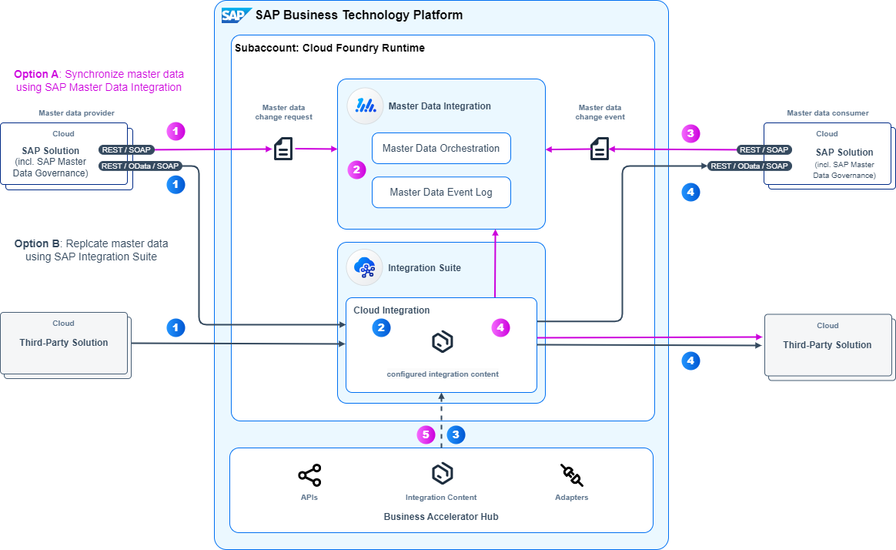

<!-- dc-ref-arch-metadata : 
    {
        "id": "ref-arch-master-data-integration",
        "name": "Master Data Integration",
        "shortDescription": "With the help of master data integration, you can share replicate master data objects across connected business applications.",
        "archDiagramLink": "images/ref-arch-master-data-integration.png",
        "tags": "Integration , sap integration suite, sap master data integration, mdi, isa-m, process integration style, cloud2cloud, cloud integration, master data integration",
        "category": "Integration"
    }
dc-ref-arch-metadata  -->

<!-- dc-ref-arch-detail-page-start -->
## **Master Data Integration**
With the help of master data integration, you can replicate master data objects across connected business applications. Master data is basic data about business-relevant objects that is required in different contexts, such as materials or business partners. For ensuring data consistency, the master data is synchronized across connected business applications in (near) real time fashion using APIs.

This reference architecture is based on the concepts of the **SAP Integration Solution Advisory Methodology**: Thereof, master data integration is defined as an integration use case pattern which belongs to the process integration style. The diagram shows the scope of technology services and components for a cloud-based application landscape which refers to the integration domain Cloud2Cloud of the methodology. 

### Flow

This reference architecture diagram shows the runtime perspective for master data integration in a cloud deployment. It comprises of two options for exchanging master data:

Option A is based on the **SAP Master Data Integration** service which is used for synchronizing master data. You use this option for new master data integration scenarios of SAP cloud solutions that are supported by SAP Master Data Integration. The main benefit of this option is that you can implement a central master data hub which allows connected solutions to synchronize their local master data databases with the master data database of the central hub. If you also need to synchronize this data with third-party solutions, then additionally the Cloud Integration capability within SAP Integration Suite is used. For more information, see [Integration](https://help.sap.com/docs/master-data-integration/sap-master-data-integration-prod/integration?q=Log&locale=en-US) of SAP Master Data Integration product documentation. Existing implementations, where the Cloud Integration capability within SAP Integration Suite is used for the same purpose, don’t need to be newly implemented using SAP Master Data Integration.

Option B uses solely the **Cloud Integration capability within SAP Integration Suite** for replicating master data across SAP and third-party solutions. You use this option for master data integration scenarios that are not supported by the SAP Master Data Integration service yet.

If you are looking to implement master data management processes such as consolidation, data quality control, and central governance you may additionally use SAP Master Data Governance, cloud edition, which enables such functionality. Regarding the reference architecture for master data SAP Master Data Governance acts as a master data provider or master data consumer and can integrate with SAP Master Data Integration service or the Cloud Integration.

Let’s take a look at each option in detail:

**A.	Synchronize master data using SAP Master Data Integration**: This option implements a hub and spoke model for synchronizing master data across SAP solutions. Concludingly it is more efficient when synchronizing master data to multiple solutions in one go compared to replicating master data between each SAP solution one by one. The data flow is as follows:
A. Synchronize master data using SAP Master Data Integration: This option implements a hub and spoke model for synchronizing master data across SAP solutions. Concludingly it is more efficient when synchronizing master data to multiple solutions in one go compared to replicating master data between each SAP solution one by one. The data flow is as follows:
1.	Whenever a master data object is created or changed by an SAP solution, it publishes master data change events asynchronously through REST based or SOAP APIs (only for the business partner master data object) toward SAP Master Data Integration. The SAP solution acts as a master data provider as part of this integration scenario.
2.	All master data changes are stored centrally in the Master Data Event Log. Based on a distribution model which is configured in the Master Data Orchestration capability, SAP Master Data Integration provides the relevant master data change events to the respective master data consumers.
3.	The receiving SAP solution (master data consumer) retrieves the relevant changes using master data change events and updates the master data entities in their local persistence accordingly.
4.	In case the master data needs to be replicated to a third-party solution, you additionally use the Cloud Integration capability within SAP Integration Suite: It provides an SAP Master Data Integration adapter, which is used to synchronize master data from third-party and SAP solutions like SAP ECC with SAP MDI service. Furthermore, Cloud Integration allows you to map the master data into the format required by the master data consumer. It also offers a wide range of adapters to enable interoperability with third-party solutions.
5.	At SAP Business Accelerator Hub you can find further third-party integration adapters which you can import and deploy on your Cloud Integration tenant.
   
**B. Replicate  master data using the Cloud Integration capability within SAP Integration Suite**: This option enables the replication of master data between SAP and third-party solutions. The data flow is as follows:
1.	Whenever a master data object is created or changed by an SAP or third-party solution (master data provider), the respective master data objects are pushed out toward Cloud Integration. If a solution is not capable of actively pushing out created or changed master data objects, Cloud Integration can pull out the data from the master data provider using a scheduler. The master data provider connects with Cloud Integration using an appropriate adapter and transmits the master data either one-by-one or in batches toward Cloud Integration.
2.	Within Cloud Integration the message format of master data provider needs to be mapped to one of the master data consumer. In case of several different master data consumers you need to implement a mapping for each. If needed, you can apply further transformations using different steps or scripting as supported by Cloud Integration.
3.	For a lot of master data integration use cases prepackaged integration content can be found at SAP Business Accelerator Hub. You can copy, configure, and deploy this content on your Cloud Integration tenant. In addition to the adapters which are pre-shipped with Cloud Integration you can find further third-party integration adapters at SAP Business Accelerator Hub for import and deployment on your Cloud Integration tenant.
4.	Finally, the master data objects are sent to the receiving SAP or third-party solutions (master data consumers) using configured adapters that support various message and transport protocols.

<ins>Note</ins>: If you have a hybrid application landscape in place, that comprises of a mix of cloud and on-premise applications, you can adapt this reference architecture as follows by adding the following technologies:
- SAP Connectivity service which lets you establish connectivity between your cloud applications and on-premise systems running in isolated networks.
- SAP Application Interface Framework when using SAP ECC or SAP S/4HANA. It allows you to develop and monitor interfaces as well as execute error handling in a single framework residing in your SAP backend system.
  
This variant applies then to the integration domain Cloud2OnPremise of SAP Integration Solution Advisory Methodology.

### Characteristics
An architecture for master data integration can be characterized as follows:
- **Master data synchronization**: Ability to synchronize master data objects between diverse solutions which can act as master data provider and/or master data consumer system. Data synchronization aims at ensuring data consistency across a solution landscape.
- **Data transformation and harmonization**: Support of (structure and value) mappings of master data from various sources. Ideally this includes a unified representation of master data across connected solutions.
- **(Near) Real-time processing**: A (near-) real-time processing is needed to enable consistent and up-to-date availability of master data information across the organization.
- **Data security and privacy**: Ability to meet data security and compliance regulations. These include for instance the protection of sensitive data, compliant data distribution to ensure data confidentiality and integrity.

### Examples in an SAP Context
SAP delivers predefined master data integration scenarios along end-to-end business processes spanning across multiple SAP solutions. The following examples are using the SAP Master Data Integration service for synchronizing master data:
- Synchronization of the workforce person master data object between SAP S/4HANA Cloud and SAP SuccessFactors HXM Suite as part of the [Hire to Retire process (for cloud deployment)](https://api.sap.com/dfd/HR1C1-DFDDataFlowsforHRData)
- Synchronization of the cost center master data object as part of the [Source to Pay process (for cloud deployment)](https://api.sap.com/dfd/SP1C1-DFDMasterDataFlows)
- Synchronization of the customer master data object as part of the [Lead to Cash process (for cloud deployment)](https://api.sap.com/dfd/LC1C1-DFDMasterDataFlowforBusinessPartnerCustomer)
  
### Reasonable Alternatives
For selected SAP lines-of-business solutions further integration technologies are available which are tailored to the needs of the respective business solution: 
- [SAP Integration Suite, managed gateway for spend management and SAP Business Network](https://help.sap.com/docs/sisgw?locale=en-US): This solution, formerly known as SAP Ariba Cloud Integration Gateway, is based on SAP Integration Suite. It facilitates the integration of buyers' and suppliers' SAP ERP or SAP S/4HANA systems with intelligent spend solutions from SAP and SAP Business Network. Managed gateway includes self-service wizards for configuring predefined integration scenarios, automated testing, and real-time monitoring. It supports predefined integration scenarios related to spend management and Business Network solutions from SAP and also allows you to extend such scenarios to accommodate specific requirements. 

    You use the managed gateway for such predefined integration scenarios that are that are not supported by SAP Master Data Integration yet. For more information about integration scenarios that are supported by the managed gateway see [overview guide for buyers](https://help.sap.com/docs/ARIBA_CIG/1b1724b5f3e248568430b640c0412c24/dabf918d862847728f00d80025e38f28.html?locale=en-US) and [overview guide for suppliers](https://help.sap.com/docs/ARIBA_CIG/791693e960f6494b8ea0a0bae07d406c/f13af7d9e5ea4bee9afb40249063833d.html?locale=en-US).
<!-- dc-ref-arch-detail-page-end -->

### Services and Components
<!-- dc-ref-arch-services-start -->
- [SAP Integration Suite](https://discovery-center.cloud.sap/serviceCatalog/integration-suite?region=all)
- [SAP Master Data Integration](https://discovery-center.cloud.sap/serviceCatalog/master-data-integration?region=all)
- [SAP Connectivity service](https://discovery-center.cloud.sap/serviceCatalog/connectivity-service?region=all)
<!-- dc-ref-arch-services-end -->
  
### Resources
<!-- dc-ref-arch-resources-start -->
- [SAP Business Accelerator Hub](https://hub.sap.com)<!-- dc-res-metadata: {"description": "This hub is a central catalog which is hosted by SAP and allows you to discover, explore, test and consume different types of digital content such as APIs, events, integration content, adapters to accelerate integration and extension of SAP solutions."} dc-res-metadata -->: This hub is a central catalog which is hosted by SAP and allows you to discover, explore, test and consume different types of digital content such as APIs, events, integration content, adapters to accelerate integration and extension of SAP solutions.
- [SAP Application Interface Framework](https://help.sap.com/docs/SAP_APPLICATION_INTERFACE_FRAMEWORK_OVERVIEW)<!-- dc-res-metadata: {"description": ": This technology is used together with SAP ECC or SAP S/4HANA, to  develop and monitor interfaces as well as execute error handling within the SAP backend system."} dc-res-metadata -->: This technology is used together with SAP ECC or SAP S/4HANA, to  develop and monitor interfaces as well as execute error handling within the SAP backend system.
- [Cloud Integration capability within SAP Integration Suite (documentation)](https://help.sap.com/docs/cloud-integration)
- [SAP Integration Solution Advisory Methodology (documentation)](https://help.sap.com/docs/architecture_guidance/f64ada51d9f44c83a751b96f955aad5a/85bcc8675d3e42718279bf7b87dafc2d.html?locale=en-US)
- [Modernize Integration with SAP Integration Suite (openSAP course)](https://open.sap.com/courses/btp3)
- [SAP Integration Suite (SAP Community)](https://community.sap.com/topics/integration-suite)
- [SAP Master Data Integration – sharing and synchronizing master data in the integrated Intelligent Suite (blog post)](https://blogs.sap.com/2020/07/21/sap-cloud-platform-master-data-integration-sharing-and-synchronizing-master-data-in-the-integrated-intelligent-suite/)
- [SAP Integration Suite – Integration with SAP Master Data Integration (MDI) service (blog post)](https://blogs.sap.com/2022/05/20/sap-integration-suite-integration-with-sap-master-data-integration-mdi-service/) 
- [Master Data Integration and Master Data Management: What’s the Difference (blog post)](https://blogs.sap.com/2020/10/23/master-data-integration-and-master-data-management-whats-the-difference/)
- [SAP Master Data Integration (documentation)](https://help.sap.com/docs/SAP_MASTER_DATA_INTEGRATION)
- [SAP Integration Solution Advisory Methodology (documentation)](https://help.sap.com/docs/architecture_guidance/f64ada51d9f44c83a751b96f955aad5a/85bcc8675d3e42718279bf7b87dafc2d.html?locale=en-US)
- [SAP Master Data Integration in the Intelligent Enterprise (openSAP course)](https://open.sap.com/courses/mdi1)
<!-- dc-ref-arch-resources-end -->
  
### Related Missions
<!-- dc-ref-arch-related-missions-start -->
- [Use SAP Integration Suite to Synchronize Master Data](https://discovery-center.cloud.sap/missiondetail/4248/4505/)
- [Get started with SAP Integration Suite](https://discovery-center.cloud.sap/missiondetail/3258/3327/)
- [S/4HANA Cloud - Cost Center Mass Update](https://discovery-center.cloud.sap/missiondetail/3419/3459/)
<!-- dc-ref-arch-related-missions-end -->

