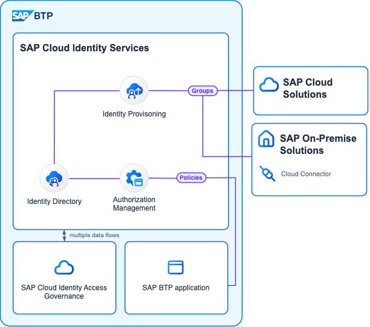

<!-- dc-ref-arch-metadata : 
    {
        "id": "ref-arch-cloud-leading-identity-lifecycle-authorizations",
        "name": "Cloud leading Identity Lifecycle Authorizations",
        "shortDescription": "This reference architecture describes how the different authorization technologies within the SAP portfolio can be used from a central point for the Identity Lifecycle.",
        "archDiagramLink": "images/SAP_IAM_SD_AuthZ_2024.png",
        "tags": "Integration , sap integration , identity, identity access management, iam, IAM, BTP IAM, user management, user, access, authorization, Cloud Identity, SAP Cloud Identity, IAS, IPS, IDDS, IdDS, AMS, authorization management",
        "category": "Security"
    }
dc-ref-arch-metadata  -->
<picture>
 <source media="(prefers-color-scheme: dark)" srcset="./images/SAP_IAM_SD_AuthZ_2024.png">
 <source media="(prefers-color-scheme: light)" srcset="./images/SAP_IAM_SD_AuthZ_2024.png">
 
</picture>
<!-- dc-ref-arch-detail-page-start -->

## **Cloud driven Identity Lifecycle Authorizations**

Authorizations are domain specific and still the aim is that they can be assigned to an identity centrally. 
Traditionally authorizations are defined in the application and are not centrally managed. This leads to a huge effort to maintain the authorizations and to ensure that the least-privilege-methodology is applied across different stacks and solutions.

SAP uses for the authorization assignments in an identity lifecycle the Identity Directory. Identity Directory is a SCIM compliant user and group store. Identity Directory acts as customer fascade for the identity lifecycle and the central point for the authorization assignments. The Cloud Identity Services also act as trusted anchor for the SAP applications for several security features like the authentication and the authorization assignments, but also the federation with 3rd party solutions.

Many systems e.g. SAP NetWeaver ABAP have a long history of defining authorizations combined in template roles in the system with detailed restrictions and derivations of those template roles.
In the SAP Business Technology Platform (BTP) the autorizations are also specified in the application. SAP BTP applications based on the SAP BTP Authorization and Trust Managemetn (XS UAA) e.g. via [SAP Cloud Application Programming Model CAP](https://cap.cloud.sap/docs/get-started/in-a-nutshell) the developer defines the app-roles within the application. In the XS UAA which is visible to you as user-management in each BTP subaccount, each customer administrator can create and maintain Role Collections. Role Collections can group multiple app-roles. Role Collections can be assigned to users, while app-roles cannot.

In the context of new applications, the [SAP Cloud Identity Services - Identity Directory](https://api.sap.com/api/IdDS_SCIM/overview) functions as the user and group store. This advanced service accommodates the [SAP Authorization Management Service (AMS)](https://help.sap.com/docs/identity-authentication/identity-authentication/configuring-authorization-policies?locale=en-US)(AMS)-defined policies, which are stored and assigned to users in the Identity Directory. The AMS allows the definition of policies by the app-developer but a central derivation and assignment to users in the Identity Directory.

### Preperation

Current SAP applications with an user- & group / role store expose those via the SCIM2 protocol.

1. The SAP Cloud Identity Services - Identity Provisioning (IPS) replicates the groups from the SAP applications into the Identity Directory.
2. SAP BTP applications based on AMS publish automatically the policies into the Identity Directory as groups.
3. SAP BTP applications based on XS UAA should be configured with IPS to replicate Role Collections into the Identity Directory as groups.

><ins>Examples:</ins>
>
>SAP S/4HANA Cloud exposes Roles as Groups and Users as Users via SCIM2.
>
>SAP Cloud Identity Services themselves use [AMS to allow finegrained authorizations](https://help.sap.com/docs/identity-authentication/identity-authentication/beta-configure-authorizations-based-on-policies?locale=en-US).

### Flow

4. The authorization assignment to a user is done in the Identity Directory.
5. This can be done by the [SCIM2 API](https://api.sap.com/api/IdDS_SCIM/overview) or by the SAP Cloud Identity Services user interface (UI).
    - The UI allows two different views:
        - The user view allows the assignment of groups to a user.
        - The groups view allows the assignment of users to a group.
    - The [SCIM2 protocol mandates](https://www.rfc-editor.org/rfc/rfc7644#section-3.5) the assignment via the /Groups endpoint by maintaining the members attribute (the UI does the same).
6. The replication of the assignments to the SAP applications is done based on the used technology:
    - Applications with an own user- & groups-store the IPS replicates the assignments to the SAP applications via periodic execution of IPS-source & target jobs.
    - AMS based applications synchronize the assignments automatically in the background.

><ins>Hint: </ins>Future applications might use different technologies integrating with the Cloud Identity Services which would allow our customers an easy adoption.

### Characteristics

This setup has the following characteristics:
- The Identity Directory is the central point for the authorization assignments.
- The authorizations are and remain domain specific - only the assignment is done centrally.
<!-- dc-ref-arch-detail-page-end -->

### Services and Components
<!-- dc-ref-arch-services-start -->
- [SAP Cloud Identity Services - Identity Provisioning](https://discovery-center.cloud.sap/serviceCatalog/identity-provisioning?service_plan=sap-cloud-to-sap-cloud&region=all&commercialModel=cloud) <!-- dc-svc-metadata: {"isPrimary": "true"} dc-svc-metadata -->
- [SAP Cloud Identity Services - Identity Authentication](https://discovery-center.cloud.sap/serviceCatalog/identity-authentication?region=all)
<!-- dc-ref-arch-services-end -->

### Resources
<!-- dc-ref-arch-resources-start -->
- [SAP Cloud Identity Services - Identity Directory](https://api.sap.com/api/IdDS_SCIM/overview)
- [SAP Cloud Identity Services - Authorization Management](https://help.sap.com/docs/identity-authentication/identity-authentication/configuring-authorization-policies?version=Cloud)
- [SAP Cloud Identity Services](https://help.sap.com/docs/cloud-identity?version=Cloud&locale=en-US)
- [More details about the SAP Identity Management End-of-Maintenance](https://community.sap.com/t5/technology-blogs-by-sap/preparing-for-sap-identity-management-s-end-of-maintenance-in-2027/ba-p/13596101)
- [SAP Cloud Application Programming Model (CAP)](https://cap.cloud.sap/docs/get-started/in-a-nutshell)
- [SCIM2 protocol](https://www.rfc-editor.org/rfc/rfc7644))
- [SCIM2 schemas](https://www.rfc-editor.org/rfc/rfc7643))
<!-- dc-ref-arch-resources-end -->

### Related Missions
<!-- dc-ref-arch-related-missions-start -->
- [Get Started with SAP BTP - Cloud Identity](https://discovery-center.cloud.sap/missiondetail/4325/4605/)
- [Configure identity lifecycle management in a hybrid SAP landscape](https://discovery-center.cloud.sap/missiondetail/3116/3152/)
- [Establish single sign-on to your cloud solutions](https://discovery-center.cloud.sap/missiondetail/3114/3151/)
<!-- dc-ref-arch-related-missions-end -->
