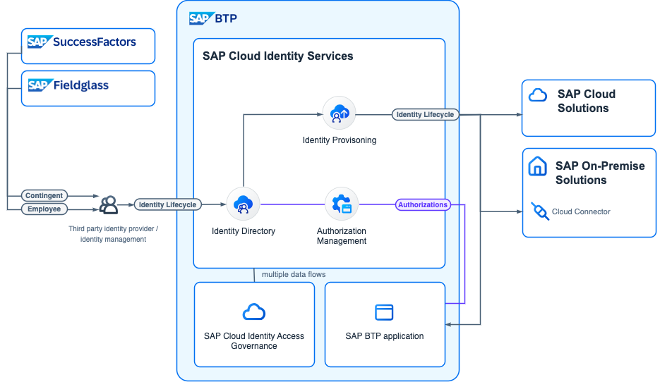

<!-- dc-ref-arch-metadata : 
    {
        "id": "ref-arch-cloud-leading-identity-lifecycle",
        "name": "Cloud leading Identity Lifecycle",
        "shortDescription": "This reference architecture describes the identity lifecycle flows for SAP applications via the SAP Cloud Identity Services.",
        "archDiagramLink": "images/Cloud-leading-Identity-Lifecycle_diagram.png",
    "archDownloadResources" : [
        {
            "type": "drawio",
            "link": "architectures/Cloud-leading-Identity-Lifecycle.drawio"
        }
    ],

        "tags": "Integration , sap integration , identity, identity access management, iam, IAM, BTP IAM, user management, user, access, authorization, Cloud Identity, SAP Cloud Identity, IAS, IPS, IDDS, IdDS, AMS, authorization management",
        "category": "Security"
    }
dc-ref-arch-metadata  -->
<picture>
 <source media="(prefers-color-scheme: dark)" srcset="./images/SAP_IAM_SD_W2I_2024.png">
 <source media="(prefers-color-scheme: light)" srcset="./images/SAP_IAM_SD_W2I_2024.png">
 
</picture>
<!-- dc-ref-arch-detail-page-start -->

## **Cloud driven Identity Lifecycle**

Every user has a user account in each system that provides services for the business scenarios that are relevant for that user. Users may be employees, consumers, or business partners, with corresponding authorization assignments. 

This reference architecture delves into the critical aspects of Identity Access Management (IAM) for SAP, focusing on essential elements, including user storage, replication, and identity lifecycle.

In an SAP landscape, users are stored across all service providers. To ensure consistency and synchronization across these diverse environments, replication is essential. Single sign-on protocols like SAML2 and OIDC play a role in this process. These protocols allow to transfer selected attributes during authentication (federation). However, their efficacy decreases when a user is offline but still needs modifications or – not to forget – deletion.
To address such challenges and maintain a seamless identity lifecycle, SAP employs SCIM2. SCIM2 facilitates the replication of users and groups into SAP solutions, ensuring a coherent and updated user landscape. 

In the context of new applications, the SAP Cloud Identity Services - Directory Service functions as the user and group store, eliminating the need for further replication to application local user stores. This advanced service accommodates the SAP Authorization Management Service-defined policies, which are stored and assigned to users in the Identity Directory. 
To get the identities into the Identity Directory the replication can occur via the leading Identity Management (IDM) tool or through the SAP Cloud Identity Services - Identity Provisioning.
The Identity Provisioning service then replicates the users and groups stored in the Identity Directory into the target applications, primarily leveraging SCIM. But this approach is not bound to SCIM. It allows a stable central interface for the SAP landscape even if the technologies for the applications within the SAP landscape change.

The architecture resulting from these boundary conditions advocates for centrally storing users and groups in the SAP Cloud Identity Services - Identity Directory. This centralized approach facilitates efficient provisioning and enhances overall control over user identities and access privileges.

For a unified access governance, SAP Cloud Identity Access Governance integrates with SAP Cloud Identity Services. This integration enables comprehensive analysis of identities and their access, helping to mitigate business risks significantly.

### Administrative and Operational Aspects

A user with an administrator role has access to the tenant-specific administration console in the browser. In the console, the administrator can use the administration services to select which identity data from which identity provider should be forwarded to which service provider by the SAP Cloud Identity Services. Furthermore, the administrator sets up the connectors to establish communication between the Identity Provisioning Service and the service providers. Different connectors are required to establish this communication, depending on the peripheral systems that should be connected. For connecting on-premise systems the SAP Connectivity service can be used. 
The SAP Cloud Identity Services rely internally also on the AMS policies. For compatibility reasons and easy onboarding, the services use a simplified access-interface today as default. We recommend activating the policies for the SAP Cloud Identity Services in the tenant for more granular and customizable authorization concepts.
Administrators of the SAP Cloud Identity Services could maintain the local identities in the Identity Directory via the administration console of SAP Cloud Identity Services. In this reference architecture it is more for verifying the data than actually maintaining identities because we foresee integrations with an IDM as leading processes.

### Conclusion

In conclusion, our reference architecture in the figure adopts a cloud driven IAM approach, underscoring the importance of robust, efficient, and scalable IAM for SAP. Embracing this approach can lead to stronger security, improved compliance, and enhanced operational efficiency, paving the way for a secure and reliable digital business environment. The SAP Cloud Identity Services act as facade for the SAP landscape and allow you a more efficient management of the identity lifecycle.

## SAP Business Technology Platform specifics

SAP Business Technology Platform (BTP) is made up of global accounts, directories and subaccounts which are used to manage and operate SaaS and custom applications and services. This involves setting up trust with the SAP Cloud Identity Services for business users as well as platform users (administrators, developers, operators) who work with SAP BTP.

In SAP BTP global accounts, administrators set up a trust with SAP Cloud Identity Services for platform users (administrator, developers, operators). This enables login to all tools used for BTP account management using Identity Authentication Service, and uses the OpenID Connect (OIDC) protocol.
In SAP BTP subaccounts, administrators set up a trust with SAP Cloud Identity Services for business users. SAP recommends the one-click integration called „Establish Trust“, since it is a prerequisite for more and more applications which natively integrate with SAP Cloud Identity services, such as SAP Build Apps, SAP Build Work Zone, or SAP Ariba Buying. This native integration of BTP applications with SAP Cloud Identity Services provides several benefits, such as full support for custom domains, application-specific authentication settings, simplified principal propagation scenarios, and usage of the Authorization Management Service (AMS). 

Please also check the IAM reference architecture focussing for authentication.

SAP plans to enable further capabilities in the future, like central administration of BTP authorizations from any number of subaccounts using the identity directory, and BTP applications to read additional user data from the identity directory instead of requiring application-specific user stores to be populated.
Established applications which use the Authorization and Trust Management (XSUAA) service of BTP are still fully supported with this kind of trust, too. The one-click integration uses the OpenID Connect (OIDC) protocol between the subaccount and SAP Cloud Identity services. Customers are still free to choose between SAML and OIDC for the integration between SAP Cloud Identity services and their corporate identity providers.

Further information is available in the Best Practices for SAP BTP.
With AMS, administrators can derive and maintain application policies centrally in SAP Cloud Identity Services instead of individual BTP subaccounts and can control authorizations on a much more fine-grained level.  
Currently nearly all SAP applications have their own user store. This has several reasons but makes remote management and compliance complex. This also applies to each BTP subaccount. The fast-evolving cloud technologies also introduced several different software stacks and ways of interacting with such user stores. SAP will simplify this with SAP Cloud Identity Services in the long run. The goal is to centralize user and group management in SAP Cloud Identity Services and to enable remote management for the whole SAP cloud landscape using SAP Cloud Identity APIs.
New applications and new BTP features require the users to exist in the identity directory. In such cases, you must populate the Identity Directory with all relevant users, for example, to assign policies of the Authorization Management service to users. While the setup of SAP Cloud Identity Services with the first such application might add additional effort to the project, it reduces the effort for any following application, because you no longer need to populate additional application-specific user stores.

### Flow

The flow contains two major aspects 1. The derivation of an Identity from a Workforce Person and 2. The assignment of access to the Identity which implicit requires the replication into the target systems.
A Workforce Person is an entity which represents the master data of employees or contigent workers. The Workforce Person could have multiple contracts with the company and most of the attributes have a time dependency.
The digitial Identity is derivation of the Workforce Person and the focus is on the current valid attributes which are relevant for the user replication and the access assignments. The Identity is the entity which is replicated into the target systems and which is used for the access assignments.

### Workforce Person to Identity

1. In the first step the Workforce Person is created or updated in the leading system. The leading system is the system which is the master data system for the Workforce Person. The leading system could be a SAP Success Factors for employees or an SAP Fieldglass for contingent workers. The leading system could also be a non-SAP system which is the master data system for the Workforce Person.
2. The Workforce to Identity derivation takes place in an Identity Management solution. The IDM consumes the source system APIs offering the workforce data APIs (not user!). The Identity Management derives out of the time-sliced attributes the current relevant values for the Identity. This process is very customers specific. 

### Identity with access assignments

3. The Identity Management solution replicates the Identity into the Identity Directory of the SAP Cloud Identity Services. The Identity Directory is the user and group store of the SAP Cloud Identity Services. The Identity Directory is the central user store for the SAP Cloud Identity Services and is used for the access assignments.
4. (OPTIONAL) The access assignments can run through access requests and access analysis to identify and mitigate business risks with the SAP Cloud Identity Access Governance.
5. The Identity Provisioning service replicates user & groups into the target systems. The IPS offers connectors for the SAP applications with preconfigured attribute-sets. 

### Characteristics

This setup has the following characteristics:
- Workforce Person to Identity derivation is a customer specific process in a 3rd party Identity Management solution.
- The Identity Directory is the central user store for the SAP landscape and is used for the access assignments. The Identity Directory offers the usage of different technologies for the access assignments e.g. SAP BTP contains: XS UAA and AMS based applications which are all supported by the Identity Directory and the Identity Provisioning Service.
- The Identity Provisioning Service replicates user & groups into the SAP target systems. 
- The identity lifecycle reference architecture should be combined with reference authentication architecture which both rely on the SAP Cloud Identity Services.
<!-- dc-ref-arch-detail-page-end -->

### Services and Components
<!-- dc-ref-arch-services-start -->
- [SAP Cloud Identity Services - Identity Provisioning](https://discovery-center.cloud.sap/serviceCatalog/identity-provisioning?service_plan=sap-cloud-to-sap-cloud&region=all&commercialModel=cloud) <!-- dc-svc-metadata: {"isPrimary": "true"} dc-svc-metadata -->
- [SAP Cloud Identity Services - Identity Authentication](https://discovery-center.cloud.sap/serviceCatalog/identity-authentication?region=all) <!-- dc-svc-metadata: {"isPrimary": "true"} dc-svc-metadata -->
<!-- dc-ref-arch-services-end -->

### Resources
<!-- dc-ref-arch-resources-start -->
- [SAP Cloud Identity Services - Identity Directory](https://api.sap.com/api/IdDS_SCIM/overview)
- [SAP Cloud Identity Services - Authorization Management](https://help.sap.com/docs/identity-authentication/identity-authentication/configuring-authorization-policies?version=Cloud)
- [SAP Cloud Identity Services](https://help.sap.com/docs/cloud-identity?version=Cloud&locale=en-US)
- [More details about the SAP Identity Management End-of-Maintenance](https://community.sap.com/t5/technology-blogs-by-sap/preparing-for-sap-identity-management-s-end-of-maintenance-in-2027/ba-p/13596101)
<!-- dc-ref-arch-resources-end -->

### Related Missions
<!-- dc-ref-arch-related-missions-start -->
- [Get Started with SAP BTP - Cloud Identity](https://discovery-center.cloud.sap/missiondetail/4325/4605/)
- [Configure identity lifecycle management in a hybrid SAP landscape](https://discovery-center.cloud.sap/missiondetail/3116/3152/)
- [Establish single sign-on to your cloud solutions](https://discovery-center.cloud.sap/missiondetail/3114/3151/)
<!-- dc-ref-arch-related-missions-end -->
